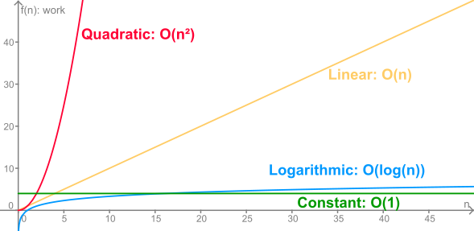

.. include:: ../global.rst

.. index:: big-O

Big-O
=================================

As we saw one the last page, the exact way in which we count units of work in an algorithm is not as important as the degree to which the algorithm depends on the size of its input. An algorithm that always involves the same amount of work is more efficient than one where the work grows as a function of the input size (at least once we pass a certain problem size).

We can further divide the algorithms where work grows as a function of input size into categories based on what kind of function determines the growth. This is the idea behind what is known as **Big-O** classification: assigning algorithms to a class of function that describe their growth. Some common categories are **Constant**, **Linear**, **Logarithmic** and **Quadratic**; their relative growth are shown in the figure below.

    
To write that an algorithm is in a particular class, we say that it is :math:`O(n)` or :math:`O(log(n))`. Spoken, we would say something like: *"Oh of n"* or *"Oh of log n"*.

* Constant : :math:`O(1)`
    Any algorithm that takes a constant amount of work. It could be 4 steps or 100 steps, the important thing is that the amount of work does not depend on the input to the algorithm.
    
    Examples: DrawSquare of size x. Looking at a class roster and deciding if there are any students enrolled - I can say "Yes" or "No" in the same time whether there are 0 names, 3 names or 100 names on the roster.
    
* Logarithmic : :math:`O(log(n))`
    Any algorithm where the relationship between work **f(n)** and input **n** is a given by logarithmic function. It could be :math:`f(n) = log_2(n)` or :math:`f(n) = 3 \cdot log_{10}(n)`. Note that we don't actually care what base the logarithm is.
    
    We will see an example of this category soon...
    
* Linear : :math:`O(n)`
    Any algorithm where the relationship between work **f(n)** and input **n** is a given by linear function. It could be :math:`f(n) = \frac{n}{2} - 4` or :math:`f(n) = 5n + 100`.
    
    Examples: DrawShape with x sides. Laying out **n** cones in a straight line.
    
* Quadratic : :math:`O(n^2)`
    Any algorithm where the relationship between work **f(n)** and input **n** is a given by quadratic function like :math:`f(n) = 5n^2 + 2`.
    
    Examples: Given a number **n**, laying out a **n** by **n** grid of cones. (If **n** is 5 there are 25 cones to lay out, if **n** = 10 there are 100 cones to place).
    
If the function that describes the work for an algorithm has multiple terms, we classify it only according to its fastest growning term. :math:`f(n) = n^2 + 2n` would be considered **Quadratic** because for large values of **n** the :math:`n^2` will dominate. Say **n** is 100: :math:`n^2 = 10,000` and :math:`2n = 200`... the extra 200 hardly even matters compared to the 10,000.