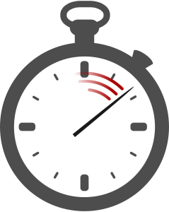
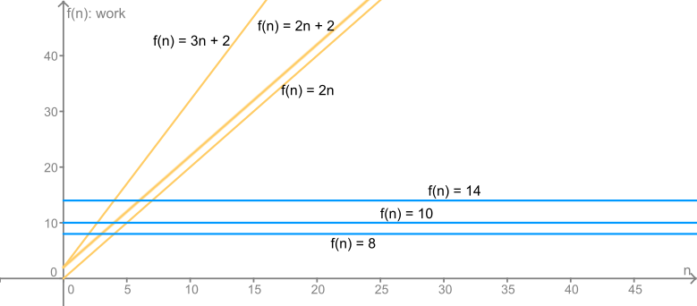

.. include:: ../global.rst

.. index::
    pair: algorithm; efficiency

Algorithm Efficiency
=================================

    
When it comes time to put an algorithm to work or choose between competing algorithms, we need a way to measure and compare algorithms. There are many different things we could measure about an algorithm: the number of lines of code to express, how much time it takes to program and debug, the amount of memory used while running, and the time taken to run are all things we might care about. But in general, the most important metric is usually "how much work does it require for a problem of size **n**"?

As users of a computer, what we usually care about is "how quick do I get my answer". A search for a file on your computer that shows results in 0.2 seconds is great; a search that takes 20 minutes would be so slow it would only be useful if you really needed that file. But the time to do something depends on many factors - how fast is the computer? how many other things is it trying to do? how big is the problem (how many files are there to search)? These factors will change depending on who is running the program and when; the fact that you are running a program on a faster computer and it takes less time than when I run it does not tell us anything interesting about the algorithm the program uses. 

So instead of actually measuring time when measuring algorithms, we usually think in terms of work required. The work required to perform a particular algorithm does not generally change when it is executed on different machines or under different conditions. So what exactly is "work"? Let's try to come up with some descriptions of how much work two different algorithms take. First, we will consider this DrawSquare algorithm:

.. faux_code:: 

    **DrawSquare of size (x)**
    Pen Down
    Repeat 4 times:
    \     Move (x)
    \     Turn Clockwise (90)
    Pen Up
    
We might say it requires 10 "units" of work: Pen Down + 4 Moves + 4 Turns + Pen Up. Note that it doesn't matter what size the square is (assuming Move always takes a fixed amount of time), this algorithm always requires 10 steps of work. If we decided that the pen up and pen down happen instantly and don't count as work than we might say the algorithm only took 8 "units" of work (4 Moves + 4 Turns); if we decided that processing the "Repeat" took one unit of work for each loop we might say that the algorithm requires 14 units (Pen Down + 4 Moves + 4 Turns + 4 Repeats + Pen Up). But whatever we decide, the problem always takes that amount of work.

Compare that to the following algorithm:

.. faux_code:: 

    **DrawShape with (x) sides**
    Pen Down
    Repeat (x) times:
    \     Move 100
    \     Turn Clockwise ( 360 / (x) )
    Pen Up

If we use it to draw a square and stick to our original accounting method, it takes 10 "units" of work. But what if use it to draw a triangle? Now it would take 8 units of work (Pen Down + 3 Moves + 3 Turns + Pen Up). If we use it to draw a pentagon it would take 12 units of work (Pen Down + 5 Moves + 5 Turns + Pen Up). A decagon would take 22 units (Pen Down + 10 Moves + 10 Turns + Pen Up). For this algorithm, the amount of work grows as the input (number of sides) grows. 

If we do a little thinking, we could come up with a function relating the amount of work required **f(x)** to the number of sides **x**: **f(x) = 2x + 2**. Each side of the shape takes two steps, and there are two steps for putting the Pen Down and Up. 

If we decided the Pen Up/Down didn't count, we might say the function for calculating work was just **f(x) = 2x**. If we decided that each time we "Repeat" it costs a unit of work, each side would require three steps and the function might be **f(x) = 3x + 2**.

The graph below compares the work required for the two algorithms. The x-axis represents the value of x input to the algorithms while the y-axis represents the work required.

    .. 
    
    Comparison of 3 different ways of counting work for 2 different algorithms - Draw Square (Blue) and Draw Shape (Gold)
    
What should be clear is that it does not really matter which accounting system we use when comparing the two algorithms. By any counting system, if we are drawing a large number of sides, the DrawShape algorithm has to do more work than the DrawSquare algorithm.
