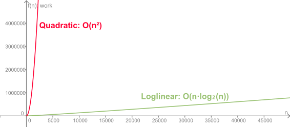

.. include:: ../global.rst

.. index:: 
    single: merge sort; efficiency

Merge Sort Compared
=================================

We have established that the Merge Sort algorithm requires :math:`O(n·log_2(n))` work to sort a list of size **n**. How does that compare to Insertion and Selection sort that are :math:`O(n^2)`? 

Below is a graph of the growth of :math:`n^2` and :math:`n·log_2(n)`:

Obviously, :math:`n^2` grows much faster than :math:`n·log_2(n)`. Looking at the table below, we can see that sorting 500 items with Insertion Sort (\ :math:`O(n^2)`) would take somewhere around 250,000 units of work. Doing the same task with Merge Sort would only take around 4,483 units of work! 

.. table::
    :class: place-values type-size-100p
    
    ==================================      ==============  ==============  ==============  ==============  ==============  ===============   
    **Problem size**                        10              100             500             1,000           10,000          100,000         
    ==================================      ==============  ==============  ==============  ==============  ==============  ===============
    :math:`n \cdot log_2(n)`                33	            664	            4,483	        9,966	        132,877	        1,660,964   
    :math:`n^2`                             100	            10,000          250,000         1,000,000       100,000,000     10,000,000,000
    ==================================      ==============  ==============  ==============  ==============  ==============  ===============
       

Using the Big-O classification of each algorithm like this gives us a rough estimate of the work. We are ignoring constant factors that may change the exact numbers (especially for low values of n). Merge Sort has more basic overhead than Insertion Sort (for example, we have to copy items to and from a second list) - if you are solving small problems it may actually take more time to run than Insertion Sort due to this. But we know that as **n** grows larger the basic pattern is going to hold - :math:`O(n^2)` is going to grow faster than :math:`O(n·log_2(n))`, so Merge Sort will certainly be faster out for large values of **n**. 

Below, you can use the Sort Timer to simulate running sorts of different sizes using the two algorithms. You can use the slider to change the size of the list being sorted. Try comparing the two algorithms at different sort sizes. Does Merge Sort always win? At what point does Insertion Sort start taking more than a half second to run? At what point does Merges Sort start taking more than a half second?

.. raw:: html
    
    
      
      
    <fieldset id="sorterBox">
        <legend>Sort Timer</legend>
        

            <strong>List Length:</strong>
            

                <input type="text" class="work" id="probSizeText" readonly="true" />
                
 

             

        

        

            <button id="goNSqButton" class="sortButton">Insertion Sort</button>
        

        

            <button id="goNLogNButton" class="sortButton">Merge Sort</button>
        

    </fieldset>
     

