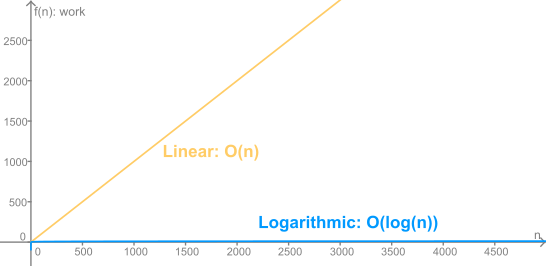

.. include:: ../global.rst

.. index:: 
    pair: linear search; big-O
    pair: binary search; big-O

Search Efficiencies
=================================

We already have discusses the fact that binary search is much more efficient than linear search, but let us quantify the difference in terms of Big-O. We will count items checked as the unit of work for searching - taking one item in a list and comparing it to what we are looking for will count as one unit.

.. pseudo_h3:: Linear Search
    :class: underlined
    
Say we have an unsorted pile of tests and we go looking for the one that belongs to one particular student. In the best case, that paper might be at the top of the pile - it would only take one unit of work. In the worst case, if we go through the pile from top to bottom, it would be the bottom paper in the pile - we would have to look at every single paper. This worst case would also apply if the paper was not even in the stack - we would have to check every paper to figure that out. The average would be somewhere between those two: sometimes we get lucky and find it early, sometimes we are less lucky - in general, we would have to look at half of the papers.

Here are those three scenarios summarized:

.. table::
    :class: place-values 

    ===============================     ===============================     ===============================
    Model                               Work for :math:`n` papers           Big-O
    ===============================     ===============================     ===============================
    **Best Case**                       :math:`f(n) = 1`                    :math:`O(1)`
    **Average Case**                    :math:`f(n) = \frac{n}{2}`          :math:`O(n)`
    **Worst Case**                      :math:`f(n) = n`                    :math:`O(n)`
    ===============================     ===============================     ===============================

Note that in terms of Big-O, :math:`f(n) = \frac{n}{2}` is the same as :math:`f(n) = n` - they are both linear functions. While it is true that in the best case, the algorithm takes 1 unit of time regardless of the number of papers, we can't count on always having the one we want at the top of the pile. Basing our rating of this algorithm on this rare exception would be misleading. So instead we will say Linear Search is :math:`O(n)`. Kind of makes sense that linear search is a linear algorithm!

.. important::
    **Linear Search** is :math:`O(n)` - **Linear**

    
.. note:: 
    
    This demonstrates a common pattern when describing work for an algorithm: The best case normally does not tell us much - it is too rare. The average case and worst case are often (though not always) the same. 
    

.. pseudo_h3:: Binary Search
    :class: underlined
    
Remember that binary search relies on jumping to the middle of the list of unchecked items and, if it is not what we want, throwing out half of the remaining items based on what we learned.

In the best case, we jump to the middle of the pile and find what we are looking for - this would only take 1 unit of work. But once again, that is a rare event. Instead, we will consider the worst case.

Imagine we are searching in a list that is 1000 items long. If we assume we have to get down to just 1 possible item and then check that one, the process would look like:

.. table::
    :class: place-values 
    
    =====================   =====================
    Items Left to Search	Comparisons So Far
    =====================   =====================
    1000                    0
    500                     1
    250	                    2
    125                     3
    62                     	4
    31                     	5
    15	                    6
    7	                    7
    3	                    8
    1	                    9
    0	                    10
    =====================   =====================

.. sidebar:: Wolfram Alpha
    
    You can use `Wolfram Alpha website <http://www.wolframalpha.com/>`__ to calculate log base 2 of 1000 by typing "log2(1000)". Try it below.
    
    .. raw:: html
    
        

Instead of counting how many times we divide the starting number by 2 we can calculate that number. Using a logarithm. Taking the base 2 logarithm of a number asks *"How many times do I have to divide this number by 2 in order to reach 1?"* Calculating :math:`log_2(1000)` gives 9.96. Since we can't do .96 units of work (each unit is checking one paper... hard to see how we can check 0.96 papers), we will round that up to 10. Since this function gives us the answer to how much work binary search requires, we will say Binary Search is :math:`O(log(n))`.

.. important::
    :class: clear

    **Binary Search** is :math:`O(log(n))` - **Logarithmic**

.. pseudo_h3:: Comparison
    :class: underlined
    
    
We have established that **Binary Search** is :math:`O(log(n))` and **Linear Search** is :math:`O(n)`, so how do those compare?

This table makes the difference pretty clear:

.. table:: Worst Case Work
    :class: place-values 

    ===============================     ===============================     ===============================
    List Size                           Linear Search	                    Binary Search
    ===============================     ===============================     ===============================
    **10,000**                          10,000                              14
    **100,000**                         100,000                             17
    **1,000,000**                       1,000,000                           20
    **1,000,000,000**                   1,000,000,000                       30
    ===============================     ===============================     ===============================

Comparing the graphs tells the same story. In relation to a Linear graph, a Logarithmic one appears to not be growing at all:

