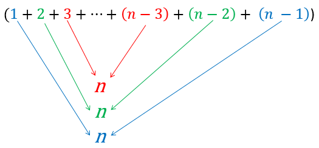

.. include:: ../global.rst

Sorting Efficiency
=================================

To figure out how efficient selection sort is, we will analyze the worst case. For units of work, we will consider comparisons and swaps - the two key operations in a sort. This video works through how much work there is for a Selection Sort on a list of 4 items:

.. youtube:: zm75IhDgO-Y
   :height: 315
   :width: 560

*Animation used by permission of Virginia Tech*

If we did the same work for a selection sort on a list of 100 things (\ :math:`n = 100`), it would look like:

.. table::
    :class: place-values type-size-100p

    ============================    ============================    ============================
    Step                            Comparisons                     Swaps
    ============================    ============================    ============================
    1                               99                              1
    2                               98                              1
    3                               97                              1
    ...                             ...                             ...
    97                              3                               1
    98                              2                               1
    99                              1                               1
    ============================    ============================    ============================

The total swaps would be 99 steps times 1 swap each = 99. Expressed in terms of :math:`n` we could say it is :math:`n - 1` swaps.

The total comparisons would be 99 + 98 + 97 + ... + 3 + 2 + 1 or :math:`(n - 1) + (n - 2) + (n - 3) + ... + 3 + 2 + 1`. So what does that equal? There is a trick to find out - pair up the first item and the last, then the second item and next to last and so on. Each pair of items sums to :math:`n`:

Since there were :math:`n - 1` numbers to start with, there will be :math:`\frac{n - 1}{2}` pairs, each of which add to :math:`n`. Multiplying the number of pairs by the sum of each pair gives us the total: :math:`\frac{n - 1}{2} \cdot n = \frac{n^2 - n}{2} = \frac{n^2}{2} - \frac{n}{2}`.

Overall, our work will be given by:

:math:`\text{Total work} = \text{Comparisons} + \text{Swaps}`

Or:

:math:`\textrm{Total work} = (\frac{n^2}{2} - \frac{n}{2}) + (n-1) = \frac{n^2}{2} + \frac{n}{2} - 1`

.. index::
    pair: selection sort; big-O
    pair: insertion sort; big-O

Since for Big-O purposes, all we care about is the class of the dominant term, in this case :math:`\frac{n^2}{2}`, we will say that Selection Sort is :math:`O(n^2)` (Quadratic). A similar process can be used to show that so is Insertion Sort.

.. important::

    **Selection** and **Insertion Sort** are **Quadratic** - :math:`O(n^2)`.
