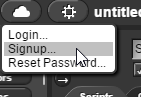

.. include:: ../../global.rst

.. index:: BYOB

Getting Started
==============================

There are two versions of BYOB.

The newest version has been renamed SNAP and runs in a webpage. It is handy if you
have a Mac or other operating system besides Windows. If you sign up for a cloud account, it makes moving files between
computers easier.

http://snap.berkeley.edu/snapsource/snap.html

The older one is a normal desktop application. If you are using
one Windows computer for all your work, it is a good option.

To download an installer for windows or for other platforms, go to Berkeley's BYOB Page:
http://snap.berkeley.edu/old-byob.html

Scroll down to the section: BYOB (old version) Downloads: and look for Current released version: 3.1.1 (19 May 2011)

.. pseudo_h2:: Saving and Opening
    :class: underlined

.. pseudo_h3:: BYOB
    :class: underlined

Any time you want to save a project, you can use the File menu to do so. It will be saved as a ".ypr" file. If you installed BYOB you will be able to double click it to open it. If you are just running BYOB out of a folder, you will have to open BYOB and then use the File → Open command, then find your saved .ypr file to reopen your saved project.

.. container:: inlinegroup

  .. image:: Images/Save1.png

  .. image:: Images/yprFile.png

.. pseudo_h3:: SNAP
    :class: underlined

In SNAP you can Save to either the local Browser or to the Cloud. If you save to the browser, your files will only be available
using that computer and that web browser. If you save to the cloud, you will be able to open files anywhere.

.. container:: inlinegroup

  .. image:: Images/SnapSave.png

  .. image:: Images/SnapSaveOpts.png

|br|
To signup for a cloud account for saving, use the Cloud menu:

