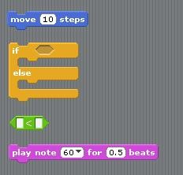
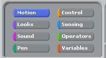
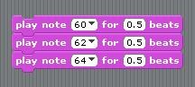
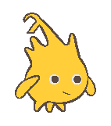
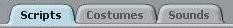
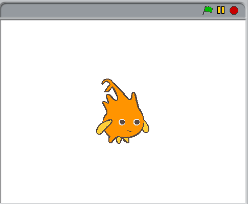

.. include:: ../../global.rst

.. index:: BYOB

BYOB Terminology
---------------------------------

Here are a few key terms/ideas you will encounter as you start learning to program
with BYOB.

---------------------

Blocks
  Instructions that can be used to make a program

.. rst-class:: clear

---------------------

Block Tabs
  Used to select blocks from different categories

.. rst-class:: clear

---------------------

Script or Program
  A series of blocks that are connected. They will run as a group from top to bottom.

.. rst-class:: clear

---------------------

Sprite
  An object that can be programmed. Every script is associated with a particular sprite.

.. rst-class:: clear

---------------------

Sprite Tabs
  Options for sprites - the objects you can program. Generally you will not need to play with the costumes or sounds.

.. rst-class:: clear

---------------------

Stage
  The area in which the sprites operate. Your scripts will run in this part of the window.

.. rst-class:: clear

|br|
