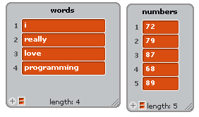

.. include:: ../../global.rst

Keep & Combine
==============================

The other two blocks we will use that take other blocks as input are **Keep* and **Combine**. This video introduces them:

.. youtube:: DuuYT4QUXnY
    :height: 315
    :width: 560

.. pseudo_h3:: Checkpoint Exercises
    :class: underlined

All of the checkpoint exercises will work on the lists shown to the right. Start by making lists that look like them.

Hint:

The combine with block should have two blanks in the reporter you use for "smashing things together". Like this:

If you put something in one of the blanks it won't work right!

.. pseudo_h3:: Keep Exercises

.. |length| image:: Images/CP62d1.png

.. tabbed:: exercise1

    .. tab:: Checkpoint A

        **Keep less than 80**

        Use **Keep** to filter the list of numbers down to those less than 80.

    .. tab:: Sample Answer

        .. image:: Images/CP63a.png

.. tabbed:: exercise2

    .. tab:: Checkpoint B

        **Keep long words**

        Use **Keep** to filter the list of words down to only words with a length of more than 4.

    .. tab:: Hint

        You need to use the |length| block.

    .. tab:: Sample Answer

        .. image:: Images/CP63b.png

.. pseudo_h3:: Combine Exercises

.. tabbed:: exercise5

    .. tab:: Checkpoint E

        **Multiply**

        Use **Combine** to multiply all the numbers in the numbers list together.

    .. tab:: Sample Answer

        .. image:: Images/CP63e.png

.. tabbed:: exercise6

    .. tab:: Checkpoint F

        **Select Minimum**

        Make a reporter block that returns the smaller of two values. Use **Combine** and that block to combine the list of numbers - you should get 68. Use them to combine the words, you should get "i" (the lowest alphabetically).

    .. tab:: Sample Answer

        .. image:: Images/CP63f.png

.. tabbed:: exercise7

    .. tab:: Checkpoint G

        **Select Longest**

        Make a reporter block that returns the longer of two words. Use **Combine** and that block to combine the list of words - you should get "programming", the longest word

    .. tab:: Sample Answer

        .. image:: Images/CP63g.png
