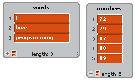

.. include:: ../../global.rst

Map
==============================

This video introduces our first tool for using higher order blocks: **Map**.

.. youtube:: JV6Or34QF7Q
    :height: 315
    :width: 560

.. note::

  **Using Tools**

  The video shows how to load the new blocks used in this chapter in BYOB. If you are using SNAP (online version), you can just go to the **File** menu and **Import Tools**

  .. image:: Images/BYOB62a.png

.. note::

    **Snap Tips**

    SNAP does not have a (copy of (list)) block. That is OK, the only reason I use (copy of (list)) is because otherwise BYOB hides the list from view - SNAP does not have that bug.

    See BYOB Chapter 3.1 for how to set up a list in SNAP if you just switched to using it.

.. pseudo_h3:: Checkpoint Exercises
    :class: underlined

All of the checkpoint exercises will work on the lists shown to the right. Start by making lists that look like them.

Two other hints:

#. The map block is your "loop". You should **not** be using any repeat blocks!

#. You should make sure the reporter block you give to map is surrounded by a gray circle. If there is no gray circle, you need to reposition the block.

   .. image:: Images/BYOB62d.png

   The block shown above says "Do [item]+3 with each *item* in numbers". Without the gray circle it would say "Do 0 + 3. Take that answer and do it to each item in numbers"... how do we "do 3 to each item"?????

.. tabbed:: exercise1

    .. tab:: Checkpoint A

        **Doubler**

        Use **Map** to make a list where each number in the numbers list is double the value in the original list. (144, 158, 174, 136, 178)

    .. tab:: Sample Answer

        .. image:: Images/CP62a1.png

.. tabbed:: exercise2

    .. tab:: Checkpoint B

        **ASCII Converter**

        Use **Map** to make a list where the numbers in the numbers list are converted to the letters that they correspond to on the ASCII table.

        Hint: use the |asciiBlock| block (BYOB) or |unicodeBlock| block (SNAP) to convert a number to a letter. The list should spell a word.

    .. tab:: Sample Answer

        .. image:: Images/CP62b2.png

.. tabbed:: exercise3

    .. tab:: Checkpoint C

        **ASCII Encoder**

        Use **Map** to make a list where you add 1 to each of the numbers, then turn it from ascii to a letter. It should be an encoded version of the word from #2 where each letter is one place later in the alphabet.

    .. tab:: Sample Answer

        .. image:: Images/CP62c.png

.. |lengthOf| image:: Images/CP62d1.png

.. tabbed:: exercise4

    .. tab:: Checkpoint D

        **Word Lengther**

        Use **Map** to make a list that consists of the length of each word from the list of words. Hint: use the |lengthOf| block - you should get a list that consists of 1, 4, 11.

    .. tab:: Sample Answer

        .. image:: Images/CP62d2.png

.. tabbed:: exercise5

    .. tab:: Checkpoint E

        **First Letter Check**

        Use **Map** to make a list that consists of true/false values. Build it by testing each word in the words list to see if the first letter is "p". You should get the list false, false, true.

    .. tab:: Hint

        Start by using Map to make a list containing the first letter of each word. Then modify that logic to see if the letter is **p**.

    .. tab:: Sample Answer

        .. image:: Images/CP62e.png
