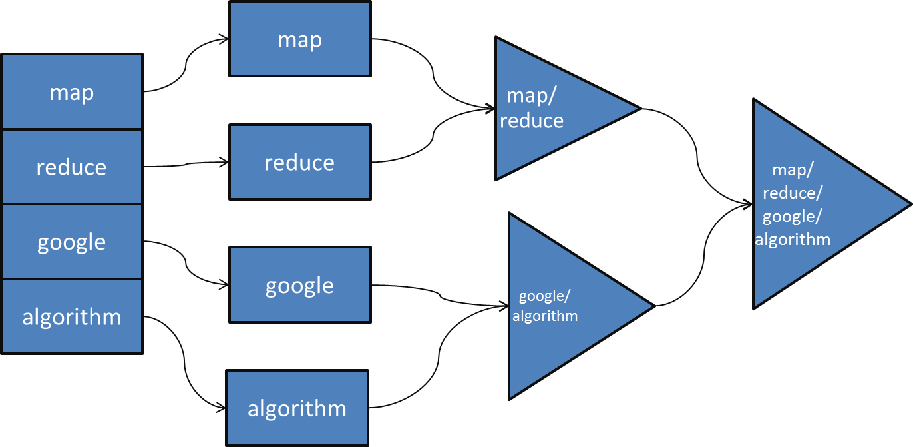

.. include:: ../../global.rst

Map / Reduce
==============================

M\ **ap/Reduce** is the name google gave to the algorithm it uses to process search requests.

Say a request comes in containing the key words "google" and "algorithm". To produce a set of matches, we need to look up each keyword in the index and then combine the results. First we Map the keyword lookup function over the different keywords. Say "google" appears on pages 1, 3, 4 and "algorithm" appears on 1, 2, 4. Then the reduce job would take those lists of pages and combine them to only keep the pages that are in both lists:  1 and 4.

In BYOB, we can do Map/Reduce style work with Map and Keep or Combine:

.. youtube:: 8yNV6vOmF40
    :height: 315
    :width: 560

Map/Reduce is usually implemented to work in parallel on many computers at once. The Mapping splits the job over many computers that all work simultaneously on parts of the problem. The Reduce also happens on multiple machines, merging results until we have one final output. Think of each shape below as a job done by one machine. We can split the original query into 4 different jobs to run on 4 different machines. Two of those jobs get reduced by another computer (upper triangle), two by another (lower triangle), finally, the results of those two jobs can be merged into one final result.

The beauty of this approach is that the complex logic of how to pass out and organize jobs only has to be written one time. There is a lot of tricky code to writing "Map" and "Reduce" functions so that they automatically distribute work to a whole farm of servers; and to handle things like making Reduce jobs wait until they get all the inputs they need, recovering when machines never provide an answer (crash), etc… But as long as we can write our programming logic as Map this job and Reduce this way, we don't have to stop and think about how it will become parallel - we can let the existing Map/Reduce framework handle distributing the work.

.. pseudo_h3:: Checkpoint Exercises
    :class: underlined

.. tabbed:: exercise1

    .. tab:: Checkpoint A

        **Even Count**

        Use Map/Reduce to count the number of even numbers in the list of numbers. Make a list of numbers to test it on like (10, 13, 7, 8, 6).

        You will need to make a custom block that reports 1 if a number is odd or 0 if it is even.

    .. tab:: Hint

        The map phase should turn each number into 0 if is odd or 1 if it is even using your custom block. The combine just needs to add up the 1's and 0's.

    .. tab:: Sample Answer

        .. image:: Images/CP64a.png

.. tabbed:: exercise2

    .. tab:: Checkpoint B

        **letter count**

        Use Map/Reduce to find the total number of letters in all the words in a sentence like "I am a code poet".

        You can use the |sentance| block to create a list from a sentence.

    .. tab:: Hint

        The mapping should turn each word into its length. The combine can add those up.

    .. tab:: Sample Answer

        .. image:: Images/CP64b.png

.. tabbed:: exercise3

    .. tab:: Checkpoint C

        **Farthest from 0**

        Make a list like (-4, 3, 5, -6, 1). Use Map/Reduce Determine how far away from 0 the number with the greatest magnitude is. (5 is 5 away from 0, -6 is 6 away from 0… so -6 is the number furthest away and the answer is 6).

        You will need to make a custom block **max** that reports the larger of two inputs.

    .. tab:: Hint

        Map should use the |abs| block to find the distance from 0. The combine block will have to use your (max of () and ()) block to reduce the list to the largest number

    .. tab:: Sample Answer

        .. image:: Images/CP64c.png
