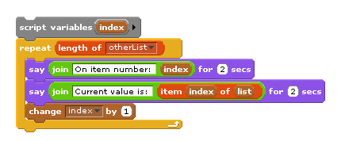

.. include:: ../../global.rst

Lists & Looping
==============================

One of the main reasons to put data into lists is so that we can process the entire list in the same way. Instead of saying:

.. faux_code::

  Do something with ``variableA``
  Do something with ``variableB``
  Do something with ``variableC``
  ...

We can say:

.. faux_code::

  Do something with item ``1`` from ``myList``
  Do something with item ``2`` from ``myList``
  Do something with item ``3`` from ``myList``
  ...

Why is that important? Well, everything in those lines is the same except for the item number. We can use a counter to
represent the item number and replace that list of instructions with a loop and one instruction. This video shows how:

.. youtube:: DuJxJh9GbNY
    :height: 315
    :width: 560

Make sure you remember the basic recipe for working through a list:

Inside the repeat, if you want to talk about "the current item number" you use the counter ``index``:

Inside the repeat, if you want to talk about "the current value" you use the ``item (index) of (list)``:

.. pseudo_h3:: Checkpoint Exercises
    :class: underlined

.. tabbed:: exercise1

    .. tab:: Checkpoint A

        **List Averager:**

        Make a block that averages the numbers in a list. You can start with the ``total numbers in list`` code from the 13:12 mark in the video. It already finds the total, you just need to divide that by the length of the list before reporting the answer.

    .. tab:: Sample Answer

      .. figure:: Images/CP32f1_key.png

        ..

        By modifying the ``total`` algorithm

      .. figure:: Images/CP32f2_key.png

        ..

        Or (even better), just use the existing total algorithm (assuming you have made the block) to get the total. Then do work to modify that answer.

.. tabbed:: exercise2

    .. tab:: Checkpoint B

        **Reverse Order:**

        Try making a block that says numbers in reverse order. Use the basic loop through list strategy, but. Start your ``index`` = to the length of the list. Change it by -1 inside the repeat to count down instead of up.

    .. tab:: Sample Answer

        .. image:: Images/CP32e_key.png
