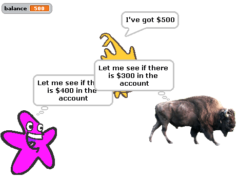
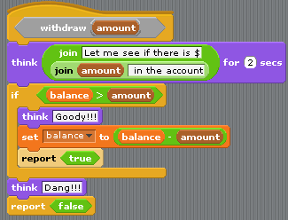
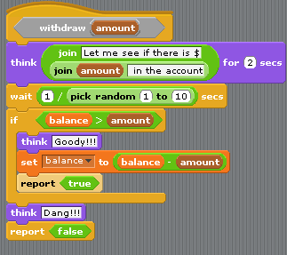
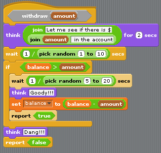

.. include:: ../../global.rst

Exercise 1: Withdrawl
==============================

This is part of your assignment - you will be doing some experiments and reporting on the results.

Open up the **Withdrawl.ypr** script from the starter files .zip. There are three sprites - Alonzo (the yellow sprite), a starfish and a buffalo. Alonzo has an account with $500 (the balance).  When the script is started, He broadcasts a message telling the other two to try to make a withdrawal. The starfish tries to grab $400 and the buffalo tries to grab $300.

They both use the Withdrawl block defined under the Variable tab. Notice that they check to see how much money is available before grabbing the amount they want. They say "Goody" if enough money is there, "Dang" if it is not available.

If the withdawl block returns true, they announce that they got their money.

.. pseudo_h3:: Part A
  :class: underlined

.. sidebar:: Hint

  When multiple sprites are trying to do something at the same time, they are generally processed from top to bottom. i.e. Whatever sprite is highest on the screen goes first.

Run the script as is a number of times to see what happens. Describe the results in the Assignment question.

.. pseudo_h3:: Part B
  :class: underlined

Modify the ``withdrawl`` script to look like this:

We are intentionally introducing the kind of random delay that often times naturally happens when computers are running multiple jobs that depend on things like accessing a disk, reading from the network etc…

Run the program using this new version of ``withdrawl`` a number of times.

* How are the results different?
* Why are they different?
* What in the changed code can explain the results?

Record your observations on your assignment.

.. pseudo_h3::  Part C
  :class: underlined

Modify the ``withdrawl`` script to look like this:

We are introducing multiple points at which a sprite that is trying to ``withdrawl`` can get stuck for a brief amount of time.

Again run the program a number of times.

* How are the results different?
* Why are they different?
* What in the changed code can explain the results?

Record your observations on your assignment.
