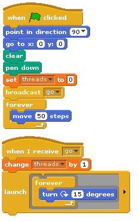

.. include:: ../../global.rst

Exercise 2: Threads
==============================

This is part of your assignment - you will be doing some experiments and reporting on the results.

Open up the **MultipleThreads.ypr** script from the starter files .zip. It has the code that was shown in the video.

**Modify** it so it looks like this:

Run the program. Experiment with pressing the space bar to add more threads.

* What does the program do with one thread?
* What does when the thread count is 3?
* What does when the thread count is 6?
* How can you explain the result of adding more threads?

Record your observations on your assignment.
