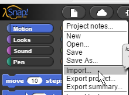

.. include:: ../../global.rst

BYOB Parallel Processing
=================================

This chapter focuses on **parallel processing** and the challenges related to it. Note that your activities for this tutorial focus less on writing your own code, and more on exploring concepts using BYOB and describing what you see. So as you watch, you don't have to worry about being able to create the programs on your own, just on explaining what is going on in them.

You can download the starter programs for this tutorial as a zip file:

`http://faculty.chemeketa.edu/ascholer/CS160/Files/BYOB/BYOB5Starters.zip <http://faculty.chemeketa.edu/ascholer/CS160/Files/BYOB/BYOB5Starters.zip>`_

Download the .zip and extract the files from it to the desktop or somewhere similar. To open the files, start BYOB and then do File->Open… and select the appropriate file.

If you are using the online version of BYOB (SNAP), you can Import the .ypr files from the .zip into SNAP to run them. Download the zip, extract the archive so the .ypr files are stored in a normal folder. Then chose Import from the Page menu and find the .ypr file you want to run.

  ..

  Importing a file from SNAP

.. toctree::
    :maxdepth: 2

    ParallelProcessing.rst
    Exercise1.rst
    MultiThreading.rst
    Exercise2.rst
