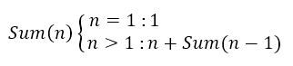
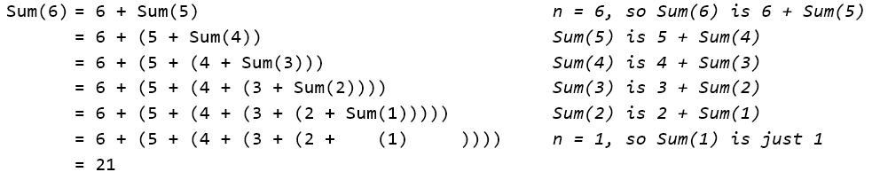

.. include:: ../../global.rst

General Recursion
==============================

Recursion is not just for drawing fractal shapes like those trees. It is a powerful tool in both mathematics and computer science for defining algorithms. Anything you can express as a loop you can express with recursion instead. But sometimes, solving a problem using recursion gives us a shorter, more "beautiful" algorithm. In some programming languages, you use recursion to do almost everything and vary rarely use something like BYOB's repeat block!

This video explores using recursion to solve problems we have solved before using loops – counting down to 1 and adding a sequence of numbers.

.. youtube:: Vc9go_NcKzE
    :height: 315
    :width: 560

To verify the recipe that the video uses to add all the numbers from 1 to n:

We can try summing all the numbers from 1 to 6 using it:

For any number we start with, we can keep applying the recipe to turn a Sum into a number and a smaller Sum. Eventually, we will reach the base case: Sum(1) for which the answer is just 1. At that point we can add up the results.

.. pseudo_h3:: Checkpoint Exercises
    :class: underlined

.. tabbed:: exercise1

    .. tab:: Checkpoint A

        **2 Count**

        Make a count by 2's from (x) down to 0 block.

        Hint: Start with the count down to 0 recipe. You have to make changes to the recursive step and to the if. The if needs to stop the recursive calls if you hit 0 or less (you don't want to count 3, 1, -1, -3…)

    .. tab:: Sample Answer

        .. image:: Images/CP42a_key.gif

.. tabbed:: exercise2

    .. tab:: Checkpoint B

        **Factorial:**

        Make a factorial(n) block. Factorial of a number is all the numbers from 1 up to that number multiplied together. You have many have seen it in a math class as ! - 5! means 5 x 4 x 3 x 2 x 1.

        Factorial(n) is defined as:

        .. image:: Images/CP42b2.png

        Translate that mathematical recipe into BYOB code.

    .. tab:: Sample Answer

        .. image:: Images/CP42b_key.gif
