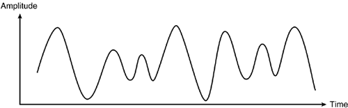

.. include:: ../global.rst

.. index:: ! analog

Analog and Digital 
=====================

The computers we are most familiar with are electrical devices. Normally, an electrical signal is an **analog** phenomenon - meaning it can change continuously change in value. The voltage flowing through a circuit can take on an infinite number of possible values. In the figure below, imagine the wave as representing the voltage on a wire over time - the voltage changes smoothly over time.

   
Now imagine we cared about the exact voltage at any point in time - that a value of 3.00000 volts means one thing and 3.00001 volts means something else. It would be very difficult to build a machine that could reliably produce exactly the right signal or measure that signal with perfect accuracy. Even the slightest bit of noise would make it impossible to tell whether we were looking at 3.00000 volts or 3.00001 volts.

.. index:: ! digital

That is one of the reasons computers are built as **digital** devices. A digital signal is only allowed to take on a limited number of possible values. Often, the only two states allowed are "on" and "off". A digital signal with only two states plotted over time thus looks like this:

     
We could have more than two possible states - we refer to "digits" in numbers as digits because they are only allowed to be 0, 1, 2, 3, 4, 5, 6, 7, 8 or 9. A single digit can't represent a value halfway between 1 and 2. The English alphabet is a digital system with 26 possible values (A-Z).
    
.. pseudo_h4:: Self Check 
    :class: underlined
    
.. mchoice:: binary_analog1
    :answer_a: Yes—the noise hides the exact values of the original signal.
    :answer_b: No—electronics can just ignore the noise.
    :answer_c: No—information has been added to the signal.
    :answer_d: Maybe—it depends on how loud the noise is.
    :correct: a
    :feedback_a:  
    :feedback_b: There is no way the electronics can perfectly tell the noise of the signal from the desired value.
    :feedback_c: Noise isn't information - we do not care about its value.
    :feedback_d: Any noise will hide the original signal - if we care about having exactly 3.00000 volts we can't afford any noise.
    
    If an **analog** signal picks up some noise (the values at each point in time change by a random amount), has information been lost?

.. quick_attribution:: ICSJava
