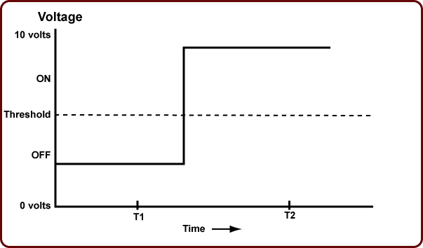

.. include:: ../global.rst

Analog To Digital
====================

We can turn an analog signal into a simple digital one with two possible states by interpreting it against a threshold. Any time we measure the value of the signal, if the value is below the threshold we call it "off"; if it is above the threshold we call it "on". In the image below, we could say at T1, the signal is off and at T2, it is on.

.. image:: Images/threshold.gif
    :alt: A threshold
    :class: padded
   
If we ignore all the changes in the signal except for where it crosses the threshold, we get a digital pattern:

   
Even if the electrical circuit that is trying to represent this pattern has a lot of noise, we should be able to distinguish the intended values. In the image below, the red line indicates the signal we are trying to represent, the grey line indicates the electrical signal that is actually measured. 

Even though there is a lot of noise - the signal is bouncing above and below the voltage we are trying to use, it is very much clear what the value should be at T1 and T2. We can ignore the noise and confidently say the signal at T1 is "off" and at T2 is "on".

.. pseudo_h4:: Self Check 
    :class: underlined

.. mchoicemf:: questionanalogdigital_1
    :answer_a: Yes—the exact value of the signal cannot be determined.
    :answer_b: No—the value of the signal can be determined, as long as the noise is not too great.
    :answer_c: No—digital signals can't pick up any noise.
    :answer_d: Yes—the signal will have extra information in it because of the noise.
    :correct: b
    :feedback_a: We don't really care about the exact value of the signal, just how it relates to the threshold.
    :feedback_b:  
    :feedback_c: Digital systems can pick up noise that changes the signal from its intended "perfect" value.
    :feedback_d: Noise does not add information, it obscures it.
    
    If a **digital** signal picks up some noise, has information been lost?

.. quick_attribution:: ICSJava