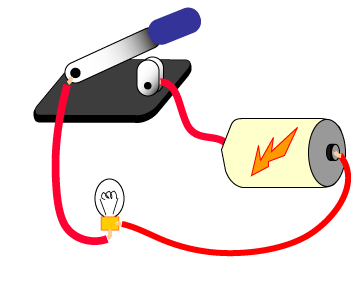
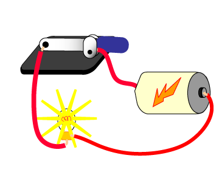

.. include:: ../global.rst

.. index:: ! binary

.. _binary:
 
Binary and Its Advantages
============================

B\ **inary** means "two states." The two states are sometimes called "1" and "0", or called "true" and "false", or called "on" and "off". The essential characteristic is that a *single binary device can be in just one of two possible states*.

A good example is a toggle switch, such as a light switch. You can turn it on or off but not (in normal operation) anything else. A light switch holds one bit of information. 

.. raw:: html

    

.. These two images are to force sphinx to copy needed images over    

    

    
A light dimmer is not a binary device: it has many positions between off and fully on. If you want a light dimmer to be set to 25%, you must carefully adjust it.

There are many advantages to binary. Here are four (somewhat overlapping) important reasons for using binary:

.. figure:: Images/shannonSmall.jpg
    :figclass: sidebar
    :alt: Claude Shannon
    
    Claude Shannon, a mathematician at Bell Telephone Laboratories, identified these characteristics of binary. His 1948 paper A Mathematical Theory of Communication is the foundation of information theory and much of computer science.    
 
#. Binary devices are Simple and easy to build
    An on/off switch is simple and easy to build. An on/off switch moves two pieces of metal together or moves them apart. A light dimmer must gradually and smoothly change the current that reaches the light. It has more components that an on/off switch and must be carefully assembled. An accurate dimmer (where 25% means exactly 25%) is even harder to build. 
    
    The same is true for the tiny devices inside of a silicon chip. On/off switches are relatively easy to fabricate. The devices are cheap, small, and reliable, and millions of them fit into a small area. 

#. Binary signals are Unambiguous (which gives them noise immunity)
    It is easy to look at a digital signal that is only supposed to be on or off and decide which it is supposed to be. Even if there is a bit of noise, we should be able to clearly tell what the signal is supposed to be 

#. Flawless copies can be made of binary data
    Remember this picture?
    
    .. image:: Images/binary_w_noise.gif
        :alt: Noise in a digital signal
        :class: padded
    
    Image now we are trying to copy the red signal but produce the grey one. When we attempt to read the copy, we can easily tell what the signal was supposed to be and restore it to the correct value. Because any noise introduced with a copy can be immediately filtered out, we can copy the information as many times as needed without worrying about the errors compounding. This is essential in a computer system, where bit patterns (patterns of one and zero, or on and off) are copied back and forth between the processor and memory millions of times a second. The copies have to be perfect.

#. Anything that can be represented with some sort of pattern can be represented with a binary pattern
    It might seem hard right now to imagine how we could represent things as diverse as numbers, music, images and text can all be represented by just "on" and "off". But we will learn tricks for converting anything that can be represented as any kind of pattern using just these two values.

.. pseudo_h4:: Self Check 
    :class: underlined
 
.. mchoice:: questionbinary_1 
    :answer_a: Binary means "containing a computer."
    :answer_b: Binary means "having only two states." 
    :answer_c: Binary means "having a discrete number of values."
    :answer_d: Binary means "using electronics to do arithmetic." 
    :correct: b
    :feedback_a:  
    :feedback_b:  
    :feedback_c: Binary does have a discrete number of values, but the correct answer is more specific
    :feedback_d: We can have binary values represented by things other than electrical signals
    
    What does **binary** mean?
  
.. mchoicema:: questionbinary_2
    :answer_a: Binary devices are simple and easy to build.
    :answer_b: Binary signals are unambiguous.
    :answer_c: Binary devices are much faster than analog devices.
    :answer_d: Binary signals can be copied flawlessly.
    :correct: a,b,d
    :feedback_a:  This is true.
    :feedback_b:  This is true.
    :feedback_c:  There is nothing inherently faster about a binary signal than an analog one.
    :feedback_d:  This is true.

    Which of the following are advantages of building computers out of binary devices?
    
.. quick_attribution:: ICSJava