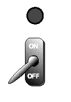
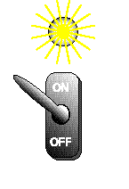

.. include:: ../global.rst

.. index:: bit

Bit Patterns
============================

A bit can only represent two possible values - 0 or 1. With one bit there are two possible patterns. How many patterns can be formed with two bits? Here is a complete list:

   | 0 0
   | 0 1
   | 1 0
   | 1 1

.. raw:: html

   

      
      
      
      

      Try clicking these switches. With two on/off switches, you should be able to make 4 different combinations of on and off.
      

   

.. These two images are to force sphinx to copy needed images over

How many patterns can be formed with three bits? Let's list them:

   | 0 0 0
   | 0 0 1
   | 0 1 0
   | 0 1 1
   | 1 0 0
   | 1 0 1
   | 1 1 0
   | 1 1 1

The list of patterns for three bits has 8 lines (patterns). Notice that the first four patterns are a "0" followed by the possible patterns for 2 bits. The second four patterns are a "1" followed by the patterns for 2 bits.

To form the list of patterns for 4 bits, we can use the same trick. Make two copies of the list for 3 bits. This gives you 16 lines. Put a "0" at the start of the first 8 lines and a "1" at the start of the second 8 lines.

This trick can be repeated as many times as you like. Adding one more bit doubles the number of patterns. The table shows the number of patterns for 1, 2, 3 and 4 bits.

Number of Bits	Number of Patterns	Number of Patterns
as power of two:

.. rst-class:: maintable

   =====   =========   =============
   Bits    Patterns    Power of two
   =====   =========   =============
   1	    2	        :math:`2^1`
   2	    4	        :math:`2^2`
   3	    8	        :math:`2^3`
   4	    16	        :math:`2^4`
   =====   =========   =============

How many patterns with 5 bits? Make two copies of the 4-bit patterns (16 patterns per copy). Make the patterns unique by prefixing "0" to the first 16 patterns and "1" to the second 16. You now have :math:`16×2 = 32 = 2^5` unique patterns. This demonstrates the following:

.. rst-class:: emphasis

    Number of possible patterns of N bits  =  :math:`2^N`

Memorize this fact. Better yet, make lists of patterns (as above) and play around until you understand. Do this now. This is an essential fact. If you allow yourself to get muddled on it, you will waste much time in this and future courses.

.. pseudo_h4:: Self Check
   :class: underlined

.. fillintheblank:: bitPatterns_1

    How many different values can be formed from a pattern of 10 bits?

    - :1024: Correct!
      :.{1,3}: That is not enough digits
      :.{5,}: That is too many digits
      :[^\d]+: Your answer should be a number
      :x: Hint: it has to be a power of 2

.. quick_attribution:: ICSJava
