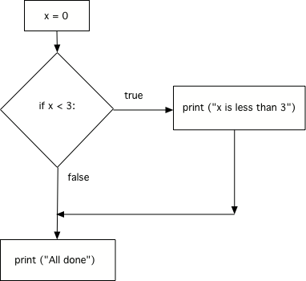

..  Copyright (C)  Mark Guzdial, Barbara Ericson, Briana Morrison
    Permission is granted to copy, distribute and/or modify this document
    under the terms of the GNU Free Documentation License, Version 1.3 or
    any later version published by the Free Software Foundation; with
    Invariant Sections being Forward, Prefaces, and Contributor List,
    no Front-Cover Texts, and no Back-Cover Texts.  A copy of the license
    is included in the section entitled "GNU Free Documentation License".

.. include:: ../csp_global.rst

The if Statement
=====================

.. index::
    pair: if; statements
    single: logical expression
    single: Boolean expression

In Python, we test data and execute instructions if the test is true using an ``if`` statement
which takes the form:

.. code::

    if TEST:
        BODY

The **test**, also known as the **condition**, must be a **logical expression** - something
that evaluates to either ``True`` or ``False``. Like a ``while`` statement, after the test,
we must type a colon (``:``) and then indent the lines of the **body** - the instructions
to execute if the test is ``True``.

While learning about ``while``, we already learned the most common way to write logical
expressions - by using **comparison operators**. As a review, here they are - the result
of using any of these is either ``True`` or ``False``:

.. index::
    single: comparison operators

+------------+---------------------------------------------------------+
| Expression | Logical meaning                                         |
+------------+---------------------------------------------------------+
| a < b      | True if a is less than b                                |
+------------+---------------------------------------------------------+
| a <= b     | True if a is less than or equal to b                    |
+------------+---------------------------------------------------------+
| a > b      | True if a is greater than b                             |
+------------+---------------------------------------------------------+
| a >= b     | True if a is greater than or equal to b                 |
+------------+---------------------------------------------------------+
| a == b     | True if a is equal to b.                                | 
|            | (Two equals signs, to distinguish it from assignment)   |
+------------+---------------------------------------------------------+
| a != b     | True if a is *not* equal to b.                          | 
+------------+---------------------------------------------------------+

Unlike a ``while``, an ``if`` will only run the instructions in its body one time. After the
instructions have executed (which only happens if the test was ``True``), Python continues
running the rest of this program. If the test isn't ``True`` (is ``False``) then execution
will skip the block following the if and continue with the next statement following the
block after the ``if`` statement.  

Run the program below in codelens. Then change the first line so that it sets x to 4 and again
run with codelens to see how the behavior differs if the test is True or False.

.. activecode:: If_Structure

    x = 0
    if x < 3:
    	print ("x is less than 3")
    print ("All done")

.. index::
    single: flowchart
    single: condition

The figure below is called a **flowchart**.  It shows the execution paths for a program. 
The diamond shape contains the **logical expression** and shows the path that the execution
takes if the logical expression is true as well as the path if the logical expression is
false.  Notice that it will only execute the statements in the indented block if the
logical expression was true. Regardless if the indented code is executed, the program
then continues running.

    Figure 3: Flow of execution for an if statement
    
.. mchoice:: 11_2_1_If_Structure
    :practice: T
    :answer_a: A
    :answer_b: B
    :answer_c: A and B
    :answer_d: Nothing
    :correct: c
    :feedback_a: A will be printed, but then the program continues running
    :feedback_b: 10 is "greater than or equal to" 8
    :feedback_c: Correct
    :feedback_d: Try modifying the program above so you can test this code.

    Given the code below, what will be printed?

    :: 

        x = 10
        if x >= 8:
            print ("A")
        print ("B")

