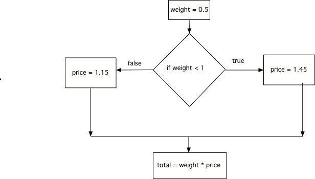

..  Copyright (C)  Mark Guzdial, Barbara Ericson, Briana Morrison
    Permission is granted to copy, distribute and/or modify this document
    under the terms of the GNU Free Documentation License, Version 1.3 or
    any later version published by the Free Software Foundation; with
    Invariant Sections being Forward, Prefaces, and Contributor List,
    no Front-Cover Texts, and no Back-Cover Texts.  A copy of the license
    is included in the section entitled "GNU Free Documentation License".

.. include:: ../csp_global.rst

Using if and else
==========================

.. index::
    single: else
   	pair: if; else

The first program we saw on the last page is a bit repetitive. It compares
``weight`` to the number 1 twice, once to see if it is below that number,
once to see if it is not below that number: 

.. code::

     if weight < 1:
         price = 1.45
     if weight >= 1: 
         price = 1.15

In situations like this, where there are exactly two mutually exclusive options (we either
have to do one or the other), there is an easier way to write the logic.
That is to use ``else``. ``else`` provides a way to say "if the condition for the preceding
if was False, do this". The body of the else - the code that will be executed if the if's test
fails - is indented after the else.

.. activeCode:: if_and_else

     weight = 0.5
     if weight < 1:
         price = 1.45
     else:
         price = 1.15           # happens if weight is NOT < 1
     total = weight * price
     print(weight)
     print(price)
     print(total)

Using an ``if`` with an ``else`` makes sure that *either* the ``if`` block is executed *or* the
``else`` block is executed, but **never** both.

    Flow of execution for both an if and else

We never **have** to use an ``else``. We can always write two seperate ``if`` statements. But
using ``else`` can help avoid bugs where there is a "gap" between the two options like we saw on
the previous page.

**Mixed up programs**

.. parsonsprob:: 11_7_1_Even_Odd
   :numbered: left
   :adaptive:

   The following program should print out "x is even" if the remainder of x divided by 2 is 0
   and "x is odd" otherwise, but the code is mixed up. Remember that the ``%`` symbol gives
   the remainder after the first number is divided by the second number.  Drag the blocks from
   the left and place them in the correct order on the right.  Be sure to also indent correctly!
   -----
   x = input("Enter a number")
   if x % 2 == 0:
       print("x is even")
   else: 
       print("x is odd")

.. parsonsprob:: 11_7_1_Shipping
   :numbered: left

   The following function should calculate the shipping cost for an order. Orders over $50 ship free.
   Otherwise, it is $5 base shipping plus $0.75 per pound. Drag the blocks from
   the left and place them in the correct order on the right.  Be sure to also indent correctly!
   -----
    def calculateShipping(orderCost, weight):
        if orderCost > 50:
            shipping = 0
        else:
            shipping = 5 + 0.75 * weight
        return shipping
