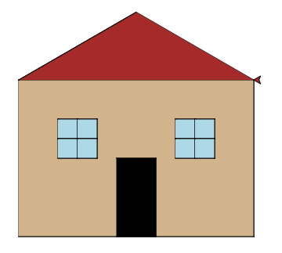

..  Copyright (C)  Mark Guzdial, Barbara Ericson, Briana Morrison
    Permission is granted to copy, distribute and/or modify this document
    under the terms of the GNU Free Documentation License, Version 1.3 or
    any later version published by the Free Software Foundation; with
    Invariant Sections being Forward, Prefaces, and Contributor List,
    no Front-Cover Texts, and no Back-Cover Texts.  A copy of the license
    is included in the section entitled "GNU Free Documentation License".

.. include:: ../CSP/csp_global.rst
.. include:: ../../global.rst

Program Design
=========================================

One of the secrets of solving large, complex problems is to do our best to turn them into
a group of smaller problems. Then, we can try to solve these small problems and test our
solutions one at a time.

.. index:: 
    single: top-down design

The process of breaking a large problem up into smaller sub-problems is known as 
**top-down design**. Start with the big problem and then use this process:

1. Decide if you can solve the problem with a small number of lines of code (ideally
~10 or less). If so, great, solve the problem. (Or put on a list of problems you will
solve when you are done breaking everything down.)

2. If the problem is too complex to solve with a small amount of code, break it up
into parts. Then repeat this process (starting from step 1) with each of the parts.

As you identify parts of a task, think about what information you will need to give
to the procedure responsible for that task so it can do its job. These will be the
parameters for your procedure. In the case of a turtle graphics program,
every procedure will need to know the name of the turtle it is supposed to use.
We also may need parameters to specify things like a size or color.

Along the way, look for places where you are writing basically the same code in
multiple places. Those are places you can maybe use a procedure to do the common
part of the work. You may have to use parameters to make the procedure flexible
enough to work in multiple situations.

Don't worry about coming up with a perfect design on your first try. Sometimes you
will think a problem is going to be easy and when you start working on it, realize
it is much harder than you anticipated. In those cases you can stop and revise your
design by breaking the complex procedure into smaller pieces.

Top-Down Design Example
-------------------------

Say I want to draw a house using turtle graphics that looks like this:

My design process might look like this:

.. faux_code::

    Can I ``drawHouse`` in ~10 lines of code? Pretty sure no. So let me break it down.  
    |space|
    Well, I need to:

    * ``drawWall`` by making a rectangle
    * ``drawDoor`` by making a smaller rectangle
    * ``drawWindow`` make a square with cross in the middle. I'll need to do this twice.
    * ``drawRoof`` which is a triangle

    OK, lets start with the ``drawWall``... That seems pretty easy. I bet I can do that in
    about 10 lines of code.
    |space|
    Moving on to the ``drawDoor``. That seems easy too. And it is a rectangle, like the wall.
    |space|
    Maybe I should make a ``drawRectangle`` that both of these use. If I do that, it needs
    to allow me to specify a ``width`` and ``height`` so I can make rectangles of different
    sizes. ``drawRectangle`` does not sound too bad - I can make that in under 10 lines. And
    if I do, the door and wall will be a snap.
    |space|
    OK, how about ``drawWindow``. Well, it might be more than 10 lines of code. But I can
    use the ``drawRectangle`` to make this easier. If I have it to use, I think this won't be
    too bad. I can just draw four small squares to make a window.
    |space|
    ``drawRoof`` doesn't sound too bad.

Now that I've broken everything down into manageable chunks, we are ready to start implementing...

.. parsonsprob:: 5_9_design_check
    :numbered: left
    :grader: dag

    Let's make sure you understand the design listed above. Arrange the blocks to implementation
    the rough design.

    Make sure you list the procedures in a valid order. Anything that draws a rectangle needs
    to come after the low-level ``rectangle`` procedure. The highest-level procedure,
    ``drawHouse`` must come after all of the other procedures because it makes use of them.
    
    Don't forget to indent the body of each function, even if it is not real code yet.
    -----
    =====
    def rectangle(turtle, width, height): #tag:0; depends:;
    =====
        draw a rectangle of requested size #tag:1; depends:0;
    =====
    def drawWall(turtleName): #tag:2; depends: 0;
    =====
        set a color
        draw a large rectangle #tag:3; depends: 2;
    =====
    def drawDoor(turtleName): #tag:4; depends: 0;
    =====
        set a color
        draw a small rectangle #tag:5; depends: 4;
    =====
    def drawWindow(turtleName): #tag:6; depends: 0;
    =====
        set a color
        draw a small square
        move
        draw a small square
        move
        draw a small square
        move
        draw a small square #tag:7; depends: 6;
    =====
    def drawRoof(turtleName): #tag:8; depends: ;
    =====
        set a color
        draw a triangle #tag:9; depends: 8;
    =====
    def drawHouse(turtleName): #tag:10; depends: 2,4,6,8;
    =====
        drawWall
        move
        drawDoor
        move
        drawWindow
        move
        drawWindow
        move
        drawRoof #tag:11; depends: 10;
    =====
    # Main part of the program
    from turtle import *
    space = Screen()
    steve = Turtle()
    drawHouse(steve) #tag:12; depends: 10;