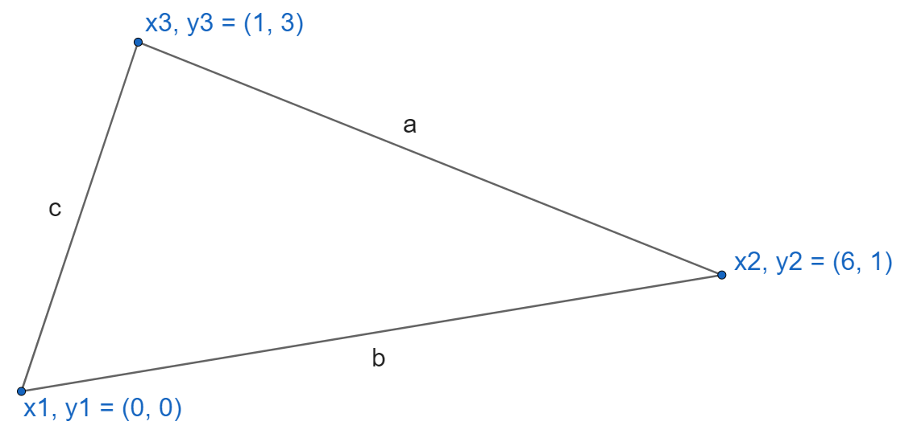

..  Copyright (C)  Mark Guzdial, Barbara Ericson, Briana Morrison
    Permission is granted to copy, distribute and/or modify this document
    under the terms of the GNU Free Documentation License, Version 1.3 or
    any later version published by the Free Software Foundation; with
    Invariant Sections being Forward, Prefaces, and Contributor List,
    no Front-Cover Texts, and no Back-Cover Texts.  A copy of the license
    is included in the section entitled "GNU Free Documentation License".

.. include:: ../CSP/csp_global.rst

Functions Calling Functions - 1
=================================

Much in the same way we can use a procedure ``drawSquare`` to help write code for a more
complex procedure like ``drawGrid``, we can use existing functions to help write new functions.

When solving complex problems, we can use this trick to avoid repeating code and to make
abstractions that make a program easier to read and write.

Say we are starting with the coordinates of the three points of a triangle and we want to
calculate the area of the shape. There is a formula called *Heron's formula* that we can use
to find the area of a triangle: :math:`\sqrt{s (s - a) (s - b) (s - c)}` where **s** is the
semi-perimeter (half the perimeter) and **a, b, c** are the lengths of the three sides.

    A triangle with sides labled a, b, and c. 

That sounds too complex to do in a short amount of code. So let's break down the problem.
Before we can use that formula, we need to know the lengths of the three sides. We can use
the distance formula to calculate them: :math:`\sqrt{(x2-x1)^2 + (y2-y1)^2}`. Let's make a
function to do that job.

When designing functions, we need to define them in terms of their inputs (parameters) and
their outputs (what they return). Our ``distance`` functions will take in two x,y pairs and it
will return the distance between them:

.. code::

    def distance(x1, y1, x2, y2):
        Do work to calculate distance.
        return distance

Let's start by writing that and testing it. We will make a function ``distance`` that has parameters for
the x and y of two different points.        

.. activecode:: triangle_area_1 
    :autograde: unittest

    This program has the function, and tests for ``sideA`` and ``sideB``. Try running it. Then
    add a test for ``sideC`` that connects point1 and point3. Call the distance formula with the correct
    arguments and store the result into ``sideC`` (Hint, the correct answer is
    ~3.16, but you must actually use the distance function to calculate it.)
    ~~~~
    def distance(x1, y1, x2, y2):
        xDifference = x2 - x1
        yDifference = y2 - y1
        distance = math.sqrt( xDifference ** 2 + yDifference ** 2 )
        return distance

    # Main program
    import math
    point1x = 0
    point1y = 0
    point2x = 6
    point2y = 2
    point3x = 1
    point3y = 3

    sideA = distance(point1x, point1y, point2x, point2y)
    print(sideA)
    sideB = distance(point2x, point2y, point3x, point3y)
    print(sideB)
    # Your test here
    ====

    from unittest.gui import TestCaseGui

    class myTests(TestCaseGui):
        def testOne(self):
            self.assertAlmostEqual(sideC, 3.16227766, 3, "Testing that you printed the right length for sideC.")
            self.assertNotRegex(self.getEditorText(), "3\.16", "Testing that you did not hard code the answer.")

    myTests().main()