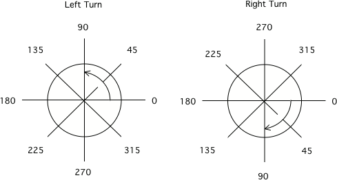

..  Copyright (C)  Mark Guzdial, Barbara Ericson, Briana Morrison
    Permission is granted to copy, distribute and/or modify this document
    under the terms of the GNU Free Documentation License, Version 1.3 or
    any later version published by the Free Software Foundation; with
    Invariant Sections being Forward, Prefaces, and Contributor List,
    no Front-Cover Texts, and no Back-Cover Texts.  A copy of the license
    is included in the section entitled "GNU Free Documentation License".

.. include:: ../csp_global.rst

Turtles as Objects
==============================

.. index::
    single: object
    pair: object; state
    single: mutable

Strings are just one kind of **object**.  **Objects** in programming are constructs that combine
**state** - a collection of data (attributes) - with behaviors that it can be done
with/to that data.

A string's data is a list of characters like "h e l l o   t h e r e"; its data are the functions
like ``length()`` or ``lower()`` or even the slice behavior ``[3:6]`` that allow us to work with
that list of characters.

While strings are **immutable** (they never change once created), most objects are **mutable** -
they can mutate or change. In mutable objects, when we use the behavior of the object, it will
make some kind of permanent changes.

The **turtles** we learned about in Chapter 1 are an example of a mutable object. Each turtle
object keeps track of the state of a turtle - its location and the direction it is facing. They
have behaviors to do things like move ``forward()`` or turn ``left()``. Asking a turtle to execute
one of these behaviors, will change the location or direction of that turtle.

We have seen the example below once before.  It allows us to use the ``turtle`` library, creates
a ``space`` for a turtle object to draw on, creates a ``turtle`` object and names it ``alex``,
asks ``alex`` to go forward by 150 pixels, asks ``alex`` to turn left 90 degrees, and asks ``alex``
to go forward 75 pixels.

.. activecode:: Turtle_1_Again
    :nocodelens:

    from turtle import *    # use the turtle library
    space = Screen()        # create a turtle space
    alex = Turtle()         # create a turtle named alex
    alex.forward(150)       # move forward by 150 units
    alex.left(90)           # turn left 90 degrees
    alex.forward(75)        # move forward by 75 units

.. mchoice:: 4_1_2_Turtle_Dir_Q1
    :practice: T
    :answer_a: North
    :answer_b: South
    :answer_c: East
    :answer_d: West
    :correct: c
    :feedback_a: The turtles in some of the examples faced north because of the <code>setheading(90)</code> instruction. Which way does alex move first?
    :feedback_b: Which way does alex first move in the example above?  North is at the top of the page.
    :feedback_c: Turtles start off facing east which is toward the right side of the page.
    :feedback_d: Which way does the turtle first move in the example above?   North is at the top of the page.

    Which way does a turtle face when it is first created?

What does a left turn of 90 mean?
----------------------------------

Turn instructions are always relative to the turtle's current direction. The instruction
``alex.left(90)`` tells the turtle named alex to make a quarter circle turn to its left -
or counter-clockwise. If alex is currently facing East, it would end up facing North. If
it is currently facing North, it would end up facing West.

    The amount of turn for specified degrees for left and right turns. These diagrams assume the
    turtle is currently pointing East (to the right of your screen).

**Mixed up programs**

.. parsonsprob:: 4_1_3_Turtle_L
    :numbered: left
    :adaptive:

    The following program uses a turtle to draw a capital L as shown below, but the lines are mixed up.  The program should do all necessary set-up: import the turtle module, get the space to draw on, and create the turtle.  The turtle should turn to face south, draw a line that is 150 pixels long, then turn to face east, and draw a line that is 75 pixels long.  

    Drag the needed blocks of statements from the left column to the right column and put them in the right
    order.  The numbers listed are **NOT** the correct order - do not assume block 1 comes first. **In this
    problem there are extra blocks you will not use.** You will only use 1a or 1b, not both.
    Same with 2a/2b, 4a/4b, etc...  

    When you think you are done, click on *Check* to see if you are right.

    .. image:: Figures/TurtleL4.png
        :width: 200px
        :align: center
    -----
    from turtle import *
    =====
    from turtle Import * #paired
    =====
    space = Screen()
    =====
    space = screen() #paired
    =====
    ella = Turtle()
    =====
    ella.right(90)
    =====
    ella.turn(90) #paired
    =====
    ella.forward(150)
    =====
    ella.left(90)
    =====
    ella.forward(75)
    =====
    ella.go(75) #paired

.. parsonsprob:: 4_1_4_Turtle_Check
    :numbered: left
    :adaptive:

    .. image:: Figures/checkMark.png
        :width: 200px
        :align: center

    The following program uses a turtle to draw a checkmark as shown below but the lines are mixed
    up. The program should do all necessary set-up: import the turtle module, get the space to draw
    on, and create the turtle.  The turtle should turn to face southeast, draw a line that is 75
    pixels long, then turn to face northeast, and draw a line that is 150 pixels long.  We have
    added a compass to the picture to indicate the directions north, south, west, and east.  
    Northeast is between north and east. Southeast is between south and east. 
    
    Drag the needed blocks of statements from the left column to the right column and put them in
    the right order.  The numbers listed are **NOT** the correct order - do not assume block 1
    comes first. **Like last time, you will not use all the blocks.** You will only use 1a or 1b, not both.
    Same with 2a/2b, 4a/4b, etc...   
    
    When you think you are done, click on *Check* to see if you are right.
    -----
    from turtle import *
    =====
    space = Screen()
    =====
    maria = Turtle()
    =====
    maria = Turtle #paired
    =====
    maria.right(45)
    =====
    maria.left(45) #paired
    =====
    maria.forward(75)
    =====
    maria.Forward(75) #paired
    =====
    maria.left(90)
    =====
    maria.right(90) #paired
    =====
    maria.forward(150)

