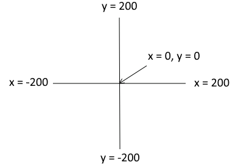

..  Copyright (C)  Mark Guzdial, Barbara Ericson, Briana Morrison
    Permission is granted to copy, distribute and/or modify this document
    under the terms of the GNU Free Documentation License, Version 1.3 or
    any later version published by the Free Software Foundation; with
    Invariant Sections being Forward, Prefaces, and Contributor List,
    no Front-Cover Texts, and no Back-Cover Texts.  A copy of the license
    is included in the section entitled "GNU Free Documentation License".

.. include:: ../CSP/csp_global.rst

Turtle Coordinates
=======================================

The space that the turtle draws in is 400 by 400 pixels.  The center of the space is at x=0, y=0.

    The coordinates for the drawing space.  Note that the center is x = 0 and y = 0.

The program below draws a snowman on a blue background by drawing 4 circles. It positions each of
the circles using ``goto(x,y)`` to move the turtle to exactly where we want it centered. To draw
a circle, we use a trick: we use ``pensize`` to make a really big (circular) pen, then do
``forward(0)`` to make a dot of the current ``color``.

.. activecode:: Turtle_Snowman
    :nocodelens:

    from turtle import *
    space = Screen()
    mario = Turtle()

    # Background
    mario.color("sky blue")
    mario.pensize(800)
    mario.forward(0)                # Draw a blue dot that covers the screen

    # Base - a 200px circle centered at 0, -160
    mario.color("white")
    mario.penup()                   # Pick up the pen so we don't draw when we goto
    mario.goto(0, -160)             # Jump directly to x = 0, y = -160
    mario.pendown()
    mario.pensize(200)
    mario.forward(0)                # Draw a dot at the current pensize

    # Body - a 150px circle centered at 0, 0
    mario.penup()
    mario.goto(0, 0)
    mario.pendown()
    mario.pensize(150)
    mario.forward(0)

    # Head - a 100px circle centered at 0, 120
    mario.penup()
    mario.goto(0, 120)
    mario.pendown()
    mario.pensize(100)
    mario.forward(0)

The program below uses the ``goto(x,y)`` to move to the top left corner before drawing a square
that nearly fills the drawing space. It uses ``fillcolor``, ``begin_fill``, and ``end_fill`` to fill in the
shape as it draws it.

.. activecode:: Turtle_Bounds
    :nocodelens:

    from turtle import *
    space = Screen()
    anu = Turtle()

    anu.penup()                         # Pick up the pen so we don't draw when we goto
    anu.goto(-150, 150)                 # Jump directly to x = -150, y = 150

    # Setup to draw the square
    anu.pendown()
    anu.color("purple")                 # Set the line color
    anu.pensize(4)                      # Draw with a pen that is 4 pixels in size
    anu.fillcolor("pink")               # Set the fill color

    # Do the drawing
    anu.begin_fill()                    # Shade inside the area we cover
    anu.forward(300)
    anu.right(90)
    anu.forward(300)
    anu.right(90)
    anu.forward(300)
    anu.right(90)
    anu.forward(300)
    anu.end_fill()                      # Stop filling as we move

    # Goto the center without drawing as we move
    anu.penup()
    anu.goto(0, 0)

**Mixed up programs**

.. parsonsprob:: 4_4_1_DrawF
   :numbered: left
   :adaptive:

   The following program uses a turtle to draw a capital F as shown below, but the lines are mixed up.  The program should do all necessary set-up: import the turtle module, get the space to draw on, and create the turtle.  It should draw the lines in the order shown by the numbers in the picture on the left.

   Drag the needed blocks of statements from the left column to the right column and put them in the right order.  There may be extra blocks that are not needed in a correct solution.  Then click on *Check* to see if you are right.

   .. image:: Figures/DrawFwGT.png
      :width: 200px
      :align: center
   -----
   from turtle import *
   space = Screen()
   anu = Turtle()
   =====
   anu.left(90)
   anu.forward(100)
   =====
   anu.right(90)
   anu.forward(50)
   =====
   anu.left(90)
   anu.forward(50) #distractor
   =====
   anu.penup()
   =====
   anu.penUp() #distractor
   =====
   anu.goto(0,60)
   =====
   anu.goTo(0,60) #distractor
   =====
   anu.pendown()
   =====
   anu.penDown() #distractor
   =====
   anu.forward(50)

.. parsonsprob:: 4_4_2_DrawA
   :numbered: left
   :adaptive:

   The following program uses a turtle to draw a capital A as shown below, but the lines are mixed up.  The program should do all necessary set-up: import the turtle module, get the space to draw on, and create the turtle.  It should draw the lines in the order shown by the numbers in the picture on the left. Drag the needed blocks of statements from the left column to the right column and put them in the right order. There may be additional blocks that are not needed in a correct solution. Then click on *Check* to see if you are right.

   .. image:: Figures/DrawABig.png
      :width: 200px
      :align: center
   -----
   from turtle import *
   =====
   space = Screen()
   =====
   space = screen() #distractor
   =====
   ella = Turtle()
   =====
   ella = Turtle #distractor
   =====
   ella.left(60)
   ella.forward(100)
   =====
   ella.left(60)
   ella.forward() #distractor
   =====
   ella.right(120)
   ella.forward(100)
   =====
   ella.penup()
   ella.goto(30,50)
   ella.pendown()
   =====
   ella.left(60)
   ella.forward(40)
   =====
   ella.Left(60)
   ella.forward(40) #distractor

