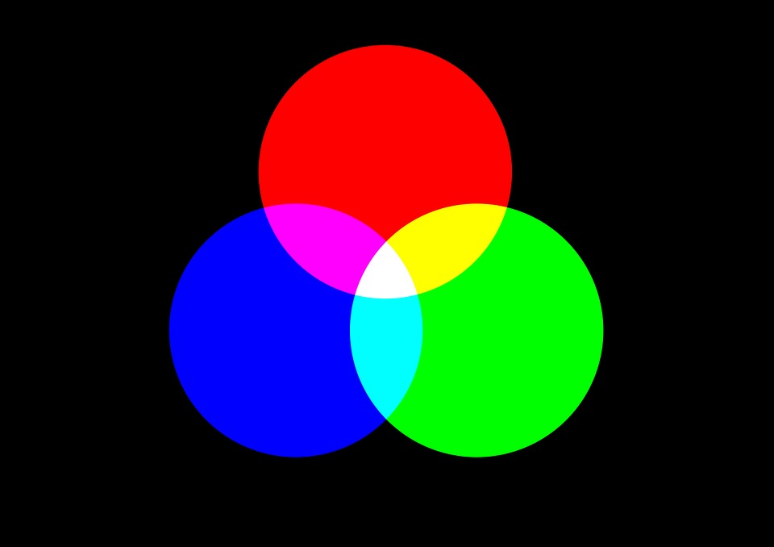

..  Copyright (C)  Mark Guzdial, Barbara Ericson, Briana Morrison
    Permission is granted to copy, distribute and/or modify this document
    under the terms of the GNU Free Documentation License, Version 1.3 or
    any later version published by the Free Software Foundation; with
    Invariant Sections being Forward, Prefaces, and Contributor List,
    no Front-Cover Texts, and no Back-Cover Texts.  A copy of the license
    is included in the section entitled "GNU Free Documentation License".

..  shortname:: Chapter: What You Can Do with a Computer
..  description:: Some tidbits of what you can do with a computer

.. setup for automatic question numbering.

.. include:: includes.rst

Compute with Images
====================

.. index::
    single: images
    
.. index::
    single: pictures
    
.. index::
    single: pixels
    
Pictures on a computer are broken up into little bits called **pixels**, for *picture* (pix)
*elements* (els).  These are laid out on a grid, from left to right (the horizontal or **x**
dimension) and top to bottom (the vertical or **y** dimension).

.. figure:: Figures/grid.png
    :align: center
    :alt: A grid with horizontal (x) and vertical (y) dimensions 
    :figclass: align-center
    
    Figure 1: A grid with horizontal (x) and vertical (y) dimensions 

Pixels are quite small.  Even this small picture below has 180 columns and 240 rows of pixels:

.. figure:: Figures/arch.jpg
    :align: center
    :alt: picture of an arch from Oxford, England
    :figclass: align-center
    
    Figure 2: Picture of an arch from Oxford, England
    
.. mchoice:: 1_5_1_Image_Q1
   :answer_a: From left to right
   :answer_b: From right to left
   :answer_c: From top to bottom
   :answer_d: From bottom to top
   :correct: c
   :feedback_a: The x value increases from left to right
   :feedback_b: The horizontal direction is the x direction
   :feedback_c: The y value increases from top to bottom
   :feedback_d: This is common on a Cartesian coordinate system, but it is not true here
   
   Which way does y increase on an image?

Each pixel has a color associated with it: An amount of red, an amount of green, and an amount of
blue.  The amount can be in the range of 0 to 255 where 0 is none of that color and 255 is the
maximum amount of that color.  A pixel is displayed using light, not paint, so it may work a bit
differently than you might expect if you only have experience making colors by mixing paint.  For
example, you would mix blue and yellow paint to make green, but you mix red and green light to make
yellow light.

    
    Figure 3: How lights combine to make colors

All image manipulations in programs like Photoshop or Instagram filters are created through
manipulating those red, green, and blue color components in each pixel. 

Let's remove the red from this picture.  The program below does that.

In Python, images are another example of an **object**. To work with them, we will make use of
another **library**, this one called ``image``. That library will allow us to make an ``Image``
that holds the data from an image and an ``ImageWin`` which draws that image to the screen after
we have modified the data.
  
The lines that are important are under the comments (lines that start with a ``#``). Press the
|runbutton| button to run the program and show the changed image.  Please note that processing
all those pixels can take a few seconds.  

.. raw:: html

    
    
.. activecode:: 1_5_2_Images_Q2
    :nocodelens:

    # MAKE USE OF IMAGE LIBRARY
    from image import *
    
    # CREATE AN IMAGE FROM A FILE
    img = Image("cat.jpg")

    # LOOP THROUGH ALL THE PIXELS
    pixels = img.getPixels()
    for p in pixels:
        # CLEAR THE RED
        p.setRed(0)
        img.updatePixel(p)
           
    # SHOW THE CHANGED IMAGE 
    win = ImageWin(img.getWidth(),img.getHeight())
    img.draw(win)
    
.. mchoice:: 1_5_3_Image_Black
    :answer_a: You still see the picture, but it is all in shades of gray.  
    :answer_b: The picture is all white.
    :answer_c: The picture is all black.
    :correct: c
    :feedback_a: Not if you set all the color values to 0.
    :feedback_b: Did you try it?  This would be true if you set all the values to 255 instead of 0.
    :feedback_c: Black is the absence of light so setting all colors to 0 results in an all
        black image since there is no light.

    What do you think happens when you set all the colors to 0?  Try adding ``p.setBlue(0)`` and
    ``p.setGreen(0)`` to the program above after the ``p.setRed(0)`` and run it to check.