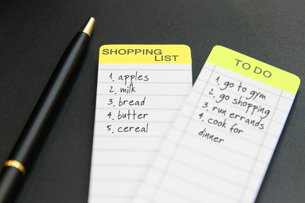

..  Copyright (C)  Mark Guzdial, Barbara Ericson, Briana Morrison
    Permission is granted to copy, distribute and/or modify this document
    under the terms of the GNU Free Documentation License, Version 1.3 or
    any later version published by the Free Software Foundation; with
    Invariant Sections being Forward, Prefaces, and Contributor List,
    no Front-Cover Texts, and no Back-Cover Texts.  A copy of the license
    is included in the section entitled "GNU Free Documentation License".

What is a List?
=================

.. index::
    single: list

A **list** is just an ordered collection of items - you probably use **lists** all the time.
People often  make a list before they go shopping or a list of things to do.  Although they
may not explicitly number the items, there is always a first thing in a list, and a second,
and so on:

    A shopping list

A **list** in Python is a collection of values. We can write a list by enclosed values in
``[`` and ``]`` and separating them by commas, like ``[1, 2, 3, 4, 5, 6, 7, 8, 9, 10]``.
The values in a list can be any type of data, and can even be a mix of types of data
(though it is often best to avoid complicating things by mixing different types of
data in one list).

.. activecode:: list_samples

    numberList = [1, 2, 3, 4, 5, 6, 7, 8, 9, 10]
    print(numberList)

    nameList = ["Dora", "Rex", "Humberto", "Devon"]
    print(nameList)

    randomList = [42, "hello", 3.14]
    print(randomList)

Recall that the ``for`` loop will automatically repeat code for each value in a list. That means
if I want to greet each name in the ``nameList`` I could do:

.. activecode:: list_for_sample

    nameList = ["Dora", "Rex", "Humberto", "Devon"]

    # Iterate through the values and call each one name
    for name in nameList:
        # Do stuff with that name
        print("Greetings", name)

Putting items into a list makes it easier to process them all in a similar way without repeating
chunks of code multiple times. Complete this algorithm for the problem discussed on the last page
of finding the highest quiz score.

.. parsonsprob:: list_basics_parson
    :numbered: left
    :practice: T
    :adaptive:

    The following program should loop through all the scores and compare them to the highest
    score we have seen so far. (When we start, the highest score we have seen is 0.) If a
    score is higher than the highest score we have seen, we need to update the highest value.
    When we are done looping through the scores, we will print the highest value we saw.
    -----
    scores = [82, 95, 92, 76, 98, 84, 89, 92]
    highest = 0
    =====
    for score in scores:
    =====
        if score > highest:
    =====
            highest = score
    =====
    print("The highest score was", highest)

