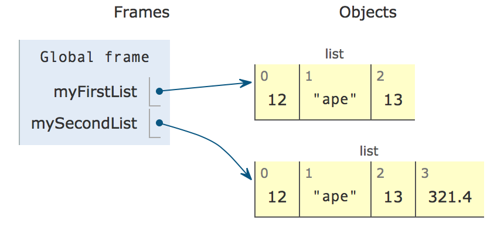

..  Copyright (C)  Mark Guzdial, Barbara Ericson, Briana Morrison
    Permission is granted to copy, distribute and/or modify this document
    under the terms of the GNU Free Documentation License, Version 1.3 or
    any later version published by the Free Software Foundation; with
    Invariant Sections being Forward, Prefaces, and Contributor List,
    no Front-Cover Texts, and no Back-Cover Texts.  A copy of the license
    is included in the section entitled "GNU Free Documentation License".

.. setup for automatic question numbering.
    
Working with Indexes
=====================

.. index:: 
    pair: list; index

Sometimes, we don't want to access all of the items in a list one at a time in order.
To access individual items in a collection (a list or a string), we can use an **index**.
Each item in a collection has a number associated with it -- think of it as the item's address in
the collection.  The first item in a collection has index ``0``, the next one ``1``, and so on.
See the image below for a view of two lists with the *index* for each list item shown at the top
of each yellow box and the *value* for that index shown at the bottom of each yellow box.

    Lists and their indices

We use square brackets to access items of the list, e.g., ``myList[0]`` will access the first
item in the list. ``myList[1]`` will access the second item in the list.

.. warning::

    In programming, we often count from 0 instead of from 1. It will take some getting used to,
    but when you see a list of things, remember that the first one it item 0. The last item
    will always have an index one less than the number of items - the last item in a list with
    10 values is index 9.

.. mchoice:: cspcollectionsintro_listindexes1
    :answer_a: 0
    :answer_b: 1
    :answer_c: 2
    :answer_d: 3
    :correct: c
    :feedback_a: This is the index of the first item in the list.
    :feedback_b: This is the index of the second item in the list.  
    :feedback_c: This is the index of the last item in this list since it contains 3 items and the first index is 0.   
    :feedback_d: The length of this list is 3, but the first index is 0 so the 3rd item is at index 2.

    What is the last index for the list ``myFirstList``?

.. mchoice:: cspcollectionsintro_listindexes2
    :answer_a: 12
    :answer_b: "ape"
    :answer_c: 13
    :answer_d: 321.4
    :correct: d
    :feedback_a: This is the value at index 0. 
    :feedback_b: This is the value at index 1.  
    :feedback_c: This is the value at index 2.
    :feedback_d: This is the value at index 3.

    What is the value of the item at index 3 in mySecondList?

You can read and write the values of individual items of a list just like they were variables.
Using ``list[index]`` on the right side of an assignment returns the value at that index in the
list. Using ``list[index]`` on the left side of an assignment statement changes the value at
that index in the list.

.. codelens:: cspcollectionsintro_listindexes3
    :showoutput:

    items = [2, 4, 6, 8]

    print(items[0])
    print(items[2])

    items[2] = 5

    print(items)

    # Set item index 3 to be 1 more than item index 2
    items[3] = items[2] + 1

    print(items)

.. mchoice:: cspcollectionsintro_listindexes4
    :practice: T
    :answer_a: [3, 2, 1]
    :answer_b: [2, 0, 2]
    :answer_c: [2, 2, 2]
    :answer_d: [2, 2, 1]
    :correct: c
    :feedback_a: That is the original contents of <code>values</code>, but the contents are changed. 
    :feedback_b: When you set <code>values[0]</code> to <code>values[1]</code> it makes a copy of the value and doesn't zero it out.
    :feedback_c: The value at index 0 is set to a copy of the value at index 1 and the value at index 2 is incremented.
    :feedback_d: Notice that we do change the value at index 2.  It is incremented by 1.

    What would the following code print?
        
    :: 

        values = [3, 2, 1]
        values[0] = values[1]
        values[2] = values[2] + 1
        print(values)

We can even use a variable that names a number as the index for an item. This sample uses 
``itemNum`` to identify which value we want from the list. As we change ``itemNum``, the
item we access by using it as an index changes as well:

.. codelens:: cspcollectionsintro_listindexes5
    :showoutput:

    items = [2, 4, 6, 8]

    itemNum = 0
    print( items[itemNum] ) 
    # prints items[0]

    itemNum = itemNum + 1
    print( items[itemNum] ) 
    # prints items[1]

    itemNum = itemNum + 2
    print( items[itemNum] ) 
    # prints items[2]

This trick will come in very handy later when we write more complex logic
for accessing all of the items in a list.

.. index:: 
    single: len

Finally, just like with a string, we can find the length of a list by using the ``len`` function. 
We can either use it in the same way we would use any other numeric value
by doing more work with it or giving the value a name to work with later:

.. codelens:: cspcollectionsintro_listindexes6
    :showoutput:

    items = [2, 4, 6, 8]

    print( len(items) )

    numberOfItems = len(items)
    print( numberOfItems )
    print("The last item is at index", numberOfItems - 1 )
