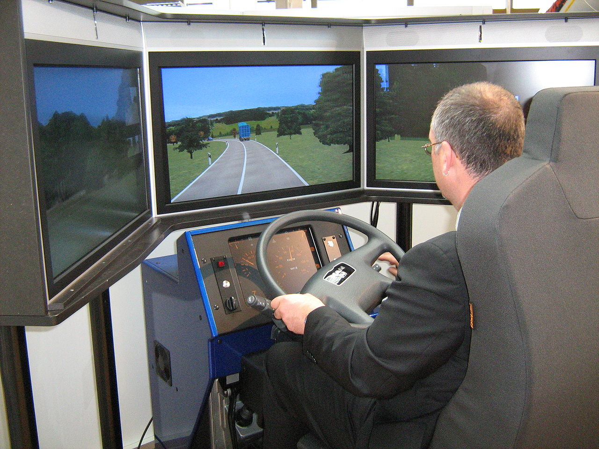

..  Copyright (C)  Mark Guzdial, Barbara Ericson, Briana Morrison
    Permission is granted to copy, distribute and/or modify this document
    under the terms of the GNU Free Documentation License, Version 1.3 or
    any later version published by the Free Software Foundation; with
    Invariant Sections being Forward, Prefaces, and Contributor List,
    no Front-Cover Texts, and no Back-Cover Texts.  A copy of the license
    is included in the section entitled "GNU Free Documentation License".

.. include:: ../CSP/csp_global.rst

Simulations
========================

.. index::
    single: simulation

Computer powered simulations have a wide variety of uses. Simulations are used to train people
in professions ranging from pilots to surgeons. They are used to provide entertainment in the
form of managing a virtual soccer team or driving a race car. And they are used to test out
scientific theories and make predictions from them.

    
    A truck driving simulator.

