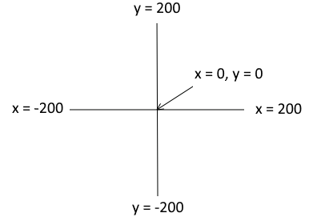

..  Copyright (C)  Mark Guzdial, Barbara Ericson, Briana Morrison
    Permission is granted to copy, distribute and/or modify this document
    under the terms of the GNU Free Documentation License, Version 1.3 or
    any later version published by the Free Software Foundation; with
    Invariant Sections being Forward, Prefaces, and Contributor List,
    no Front-Cover Texts, and no Back-Cover Texts.  A copy of the license
    is included in the section entitled "GNU Free Documentation License".

.. include:: ../CSP/csp_global.rst

Turtles And Randomness
==========================

We can use random numbers to make the results of turtle drawings unpredictable. The program
below will pick a random number between 50 and 199 and call it ``squareSize``. That number
gets passed to the ``drawSquare`` function as the size of the square to draw. Each time you
run the program, the square should be a different size.

As a reminder, here are the turtle commands:

|turtle_ref|

.. activecode:: cspdecisionssimulations_turtlerandom1
    :nocodelens:

    def drawSquare(turtleName, size):
        for side in range(4):
            turtleName.forward(size)
            turtleName.right(90)

    # main part of program
    from turtle import *
    import random
    becca = Turtle()

    # pick a random size
    squareSize = random.randrange(50, 200)
    # draw a square using that size
    drawSquare(becca, squareSize)

Note that although we want the size of the square to be random, it is important that all the
sides of the square are the same size. That is why we pick the random number in the main
part of the program. If we picked a random number on line 3 as we draw each side, each side
would be a different length! Try changing line 3 to read ``turtleName.forward(random.randrange(50, 200))``
to see for yourself.

We can also pick a random location for the turtle to start in. Remember that the turtle uses this
coordinate system:

    The coordinates for the drawing space.  Note that the center is x = 0 and y = 0.

Because the square procedure is going to make a square up to 200 wide and tall extending
to the right and down from where we start, I don't want it to start to the right or below
the point 0, 0 or it might go off screen. I am fine with it starting to the left of or above
that location, but I don't want it to start right at the edge of the screen. So I want the
starting x location to be between -190 and 0 and the starting y to be between 0 and 190.
So this version of the program uses ``goto(x, y)`` and random numbers to pick a random 
starting location before drawing the square.

.. activecode:: cspdecisionssimulations_turtlerandom2
    :nocodelens:

    def drawSquare(turtleName, size):
        for side in range(4):
            turtleName.forward(size)
            turtleName.right(90)

    # main part of program
    from turtle import *
    import random
    becca = Turtle()
    becca.speed(0)

    #pick a random starting location 
    becca.penup()
    startX = random.randrange(-190, 1)
    startY = random.randrange(0, 191)
    becca.goto(startX, startY)
    becca.pendown()

    #pick a random size and draw the square
    squareSize = random.randrange(50, 200)
    drawSquare(becca, squareSize)

Try the program a few times. Each time you should get different squares. 

Now let's make it a little more interesting by picking a random color each time the program runs.
We have added a procedure called ``changeColor``. If you pass it the name of a turtle, and three
numbers between 0-255 representing ``red``, ``green``, and ``blue`` values, it will make a hexadecimal
color code that represents the color with that much red/green/blue. It will then use that to set
the color of the turtle. Your task is to write code to pick three random numbers to use for the color
values.

.. activecode:: cspdecisionssimulations_turtlerandom3
    :nocodelens:
    :practice: T
    :autograde: unittest

    In the location marked ``TODO`` (line 38), add lines of code to make three random values that are
    each 0-255 and name them ``red``, ``green``, and ``blue``.
    ~~~~
    def changeColor(turtleName, red, green, blue):
        # red, green, blue should all be values between 0 and 255
        # changes them to a hexadecimal format like #FF3C28 and sets turtleName color with that
        redPart = hex(red)          # will look like 0xFF
        redPart = redPart[2:]       # only keep the FF part
        bluePart = hex(blue)        # same for blue and green
        bluePart = bluePart[2:] 
        greenPart = hex(green)
        greenPart = greenPart[2:] 

        colorValue = "#" + redPart + greenPart + bluePart
        print("colorValue is", colorValue)

        turtleName.fillcolor(colorValue)

    def drawSquare(turtleName, size):
        turtleName.begin_fill()
        for side in range(4):
            turtleName.forward(size)
            turtleName.right(90)
        turtleName.end_fill()

    # -------------------------------------------------
    # main part of program
    from turtle import *
    import random
    becca = Turtle()
    becca.speed(0)

    #pick a random starting location 
    becca.penup()
    startX = random.randrange(-190, 1)
    startY = random.randrange(0, 191)
    becca.goto(startX, startY)
    becca.pendown()

    # TODO - Make red, green, blue be random values between 0 and 255

    changeColor(becca, red, green, blue)

    #pick a random size and draw square
    squareSize = random.randrange(50, 200)
    drawSquare(becca, squareSize)
    =====

    from unittest.gui import TestCaseGui
    import re

    class myTests(TestCaseGui):
        def countCopies(self, regex):
            matches = re.findall(regex, self.getEditorText())
            return len(matches)

        def testOne(self):
            self.assertRegex(self.getEditorText(), r"random.randrange\(\s*0\s*,\s*25[56]\s*\)", "Testing that you make a random number 0-255 using randrange.")
            self.assertEqual(self.countCopies("random.randrange\(\s*0\s*,\s*25[56]\s*\)"), 3, "Testing that you made three random numbers 0-255.")

    myTests().main()
