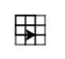

..  Copyright (C)  Mark Guzdial, Barbara Ericson, Briana Morrison
    Permission is granted to copy, distribute and/or modify this document
    under the terms of the GNU Free Documentation License, Version 1.3 or
    any later version published by the Free Software Foundation; with
    Invariant Sections being Forward, Prefaces, and Contributor List,
    no Front-Cover Texts, and no Back-Cover Texts.  A copy of the license
    is included in the section entitled "GNU Free Documentation License".

.. include:: ../CSP/csp_global.rst

Procedures that Call Procedures
=========================================

Once we start writing procedures, we may want to make use of our new abstractions to build
even more complex new procedures. We have actually already used this idea - our procedures
like ``square`` make use of existing turtle procedures like ``forward``. But we can also
use our own existing procedures to write other new procedures.

Say we want to draw this shape:

We notice that it consists of three rows. Each row consists of three squares. We already know
how to write a procedure draw a square... lets use it to write a procedure to draw a row of
squares:

.. activecode:: procedure_composition_1
    :nocodelens:

    def square(turtle, size):
        turtle.forward(size)
        turtle.right(90)
        turtle.forward(size)
        turtle.right(90)
        turtle.forward(size)
        turtle.right(90)
        turtle.forward(size)
        turtle.right(90)

    def row(turtleName):
        square(turtleName, 10)      # do square with whichever turtle we are using
        turtleName.forward(10)
        square(turtleName, 10)
        turtleName.forward(10)
        square(turtleName, 10)

    from turtle import *
    space = Screen()
    roger = Turtle()
    roger.speed(10)
    row(roger)                      # do the row procedure with roger

The ``row`` procedure has one parameter - ``turtleName``. Whatever turtle is specified as the
argument in the procedure call to ``row`` will be called ``turtleName`` inside ``row``. So
because we call ``row(roger)``, ``turtleName`` will mean ``roger``.

Inside the ``row`` procedure, we call the ``square`` procedure: ``square(turtleName, 10)``.
Because ``turtleName`` refers to ``roger`` at this point, that is the same as
``square(roger, 10)``. Because the first parameter of square is ``turtle``, that means
any time we say ``turtle`` in the square procedure, we are going to be working with
``roger``. 

Now we can use the ``row`` to help write a ``grid`` procedure that makes the final picture:

.. activecode:: procedure_composition_2
    :nocodelens:

    def square(turtle, size):
        turtle.forward(size)
        turtle.right(90)
        turtle.forward(size)
        turtle.right(90)
        turtle.forward(size)
        turtle.right(90)
        turtle.forward(size)
        turtle.right(90)

    def row(turtleName):
        square(turtleName, 10)      # do square with whichever turtle we are using
        turtleName.forward(10)
        square(turtleName, 10)
        turtleName.forward(10)
        square(turtleName, 10)
    
    def grid(turtle):
        row(turtle)

        turtle.backward(20)         # get ready for next row
        turtle.right(90)
        turtle.forward(10)
        turtle.left(90)

        row(turtle)

        turtle.backward(20)         # get ready for next row
        turtle.right(90)
        turtle.forward(10)
        turtle.left(90)

        row(turtle)

    from turtle import *
    space = Screen()
    roger = Turtle()
    roger.speed(10)
    grid(roger)                     # do the grid procedure with roger

Our ``grid`` procedure, the parameter is called ``turtle``. Which is the same name that ``square``
uses for its first parameter. It is OK for two different functions to use the same name for
their parameters. It can however be confusing... just because they have the same name, does not
mean that they are always going to have the same value. Just like two people who both make a
phone call to "Bob" may be calling the same person, or may not be.

In this case, ``roger`` is passed to ``grid``, which calls the turtle ``turtle``, and passes
it to ``row``, which calls it ``turtleName``, which passes it to ``square`` which calls it
``turtle``. Each of the functions has its own "nickname" for the turtle that they are all
working with.

.. parsonsprob:: 5_4_4_parameter_names
    :numbered: left
    :adaptive:

    The following code is supposed to draw a picture consisting of four "lines"; each "line"
    has three squares. 
    
    Put the blocks in the right order and indentation. As usual, you will
    not use all the blocks.
    -----
    def square(turtle, size):
        turtle.forward(size)
        turtle.right(90)
        turtle.forward(size)
        turtle.right(90)
        turtle.forward(size)
        turtle.right(90)
        turtle.forward(size)
        turtle.right(90)
    =====
    def line(turtleName):
    =====
        square(turtleName)
        turtleName.forward(10)
        square(turtleName)
        turtleName.forward(10)
        square(turtleName)
        turtleName.backward(20)
    =====
        square(turtle)
        turtle.forward(10)
        square(turtle)
        turtle.forward(10)
        square(turtle)
        turtle.backward(20) #distractor
    =====
    def picture(turtle):
    =====
        line(turtle)
        turtle.right(90)
        line(turtle)
        turtle.right(90)
        line(turtle)
        turtle.right(90)
        line(turtle)
    =====
        line(turtleName)
        turtleName.right(90)
        line(turtleName)
        turtleName.right(90)
        line(turtleName)
        turtleName.right(90)
        line(turtleName) #distractor
    =====
    from turtle import *
    space = Screen()
    becca = Turtle()
    picture(becca)