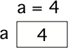

..  Copyright (C)  Mark Guzdial, Barbara Ericson, Briana Morrison
    Permission is granted to copy, distribute and/or modify this document
    under the terms of the GNU Free Documentation License, Version 1.3 or
    any later version published by the Free Software Foundation; with
    Invariant Sections being Forward, Prefaces, and Contributor List,
    no Front-Cover Texts, and no Back-Cover Texts.  A copy of the license
    is included in the section entitled "GNU Free Documentation License".

.. include:: includes.rst

Assigning a Name
==================

.. index::
    single: variable
    pair: programming; variable

A computer can associate a name with a value.  It does this by creating a **variable**, which is
space in computer memory that can represent a value. An example of a **variable** is a score in a
computer game.  The score usually starts at 0 and increases as you play the game.  The score can
change or *vary* during the game, which is why we call it a **variable**. 

Think of a variable as a box that has a label on it and you can store a value in the box.  The
value can be anything that can be represented on a computer and stored in a computer's memory.
A computer's memory is only made up of numbers (really, just patterns of voltages, but we can
think about them as numbers).  Everything that a computer can remember in its memory is translated
into these numbers -- but don't worry about how this works right now. 

    
    Creating a variable and setting its value in memory.

.. index::
    single: assignment
    pair: programming; assignment

In programming languages, setting a variable's value is also called **assignment**.  A statement
like ``a = 4`` means that the symbol ``a`` refers to space (in the computer's memory) that is
assigned the value ``4``.  When we use the symbol ``a`` in a program the computer will substitute
the value ``4``. 

.. youtube:: tULT-Nqunlc
    :width: 640
    :height: 480
    :align: center

To see it in context, run the program below. The first line sets a value for ``a``, but does not
produce any output we can see. The ``print`` command on the second line will show print out a value
so we can see it. In this case, it prints ``4`` since that is the value stored in ``a``.

.. activecode:: cspnamenumbers_assignname1
    :nocodelens:

    a = 4
    print(a)

If we later change the value stored at ``a``, say by doing ``a = 7.2`` then we say that the
variable ``a`` now has the value ``7.2`` meaning that the value in the box (memory) associated
with the name ``a`` is changed to ``7.2``.

.. figure:: Figures/changeA.png
    :align: center
    :width: 60
    :figclass: align-center
    
    Changing the value of a variable in memory.
    
Try modifying the code above. Add a new line of code, after ``a = 4`` and before ``print(a)``,
that sets a to ``7.2``. If you do so correctly, the program will print 7.2 when it runs.

.. warning:: 

    Although we use the ``=`` symbol to do assignment, you should not think of it as "equals".
    Most programmers will pronounce ``a = 4`` as "a *gets* 4" or "a *is assigned the value* 4".
    Assignment **always** takes the value of the right side of the ``=`` and stores it into
    the variable named on the left hand side. It is actually an error to switch the order and
    try to write ``4 = a`` - that says "4 *is assigned the value* a" which does not make
    sense... we can't change the value of 4.
