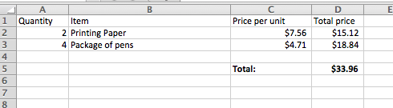

..  Copyright (C)  Mark Guzdial, Barbara Ericson, Briana Morrison
    Permission is granted to copy, distribute and/or modify this document
    under the terms of the GNU Free Documentation License, Version 1.3 or
    any later version published by the Free Software Foundation; with
    Invariant Sections being Forward, Prefaces, and Contributor List,
    no Front-Cover Texts, and no Back-Cover Texts.  A copy of the license
    is included in the section entitled "GNU Free Documentation License".

.. include:: includes.rst

Figuring out an Invoice
====================================

We can use variables to solve problems like those we might solve in a spreadsheet.  Imagine that
you had a spreadsheet with an invoice for an office supply company.

    
    A spreadsheet with order information  

Here's a program to compute the total price for the invoice:

.. activecode:: cspnamenumbers_invoice1

    quantity1 = 2
    unitPrice1 = 7.56
    total1 = quantity1 * unitPrice1
    quantity2 = 4
    unitPrice2 = 4.71
    total2 = quantity2 * unitPrice2
    invoiceTotal = total1 + total2
    print(invoiceTotal)

.. mchoice:: cspnamenumbers_invoice2
    :answer_a: 7
    :answer_b: 6
    :answer_c: 5
    :answer_d: 2
    :correct: a
    :feedback_a: Yes, quantity1, unitPrice1, total1, quantity2, unitPrice2, total2, invoiceTotal.
    :feedback_b: There are three variables per line, two lines, and one total.
    :feedback_c: There are three variables per line, two lines, and one total.
    :feedback_d: There are three variables per line, two lines, and one total.

    How many variables are in this program?

We don't really have to create new variables ``quantity2`` and ``unitPrice2``.  We only use those to compute the total for the line, and then we could reuse those variable names.

.. codelens:: cspnamenumbers_invoice3

    quantity = 2
    unitPrice = 7.56
    total1 = quantity * unitPrice
    quantity = 4
    unitPrice = 4.71
    total2 = quantity * unitPrice
    invoiceTotal = total1 + total2
    print(invoiceTotal)

.. mchoice:: cspnamenumbers_invoice4
    :answer_a: 7
    :answer_b: 6
    :answer_c: 5
    :answer_d: 2
    :correct: c
    :feedback_a: We have two fewer variables now.
    :feedback_b: We have a total for each line (two), a quantity, a unitPrice, and an invoiceTotal.
    :feedback_c: The variables are quantity, unitPrice, total1, total2, and invoiceTotal. 
    :feedback_d: We have a total for each line (two), a quantity, a unitPrice, and an invoiceTotal.

    How many variables are in this program?

Let's say that apples are $0.40 apiece, and pears are $0.65 apiece.  Modify the program below
to calculate the total cost (it should print 3.55).

.. activecode:: cspnamenumbers_invoice5

    numApples = 4
    numPears = 3

    costPerApple = 
    costPerPear = 

    totalCost =
    print(totalCost)

You are welcome to try out the following answers by copying and pasting them into the program
above before answering this question:

.. mchoice:: cspnamenumbers_invoice6
    :answer_a: totalCost = numApples + numPears
    :answer_b: totalCost = (costPerApple * numApples) + (costPerPear * numPears)
    :answer_c: totalCost = (costPerApple * numPears) + (costPerPear * numApples)
    :answer_d: totalCost = (0.4 * numApples) + (0.65 + numPears)
    :correct: b
    :feedback_a: That does not consider the cost of the apples or pears.
    :feedback_b: We need to multiply the cost per apple times the number of apples and add it to
        the cost per pear times the number of pears.
    :feedback_c: That gets the costs backwards
    :feedback_d: That would work, but giving names to numbers makes code easier to understand.

    Which line of code will compute the correct ``totalCost`` if put into the program above?

.. tabbed:: 2_9_7_WSt

    .. tab:: Question

        Write the code to calculate and print how many *paperclips* you can buy if each paperclip is $0.05 and you have $4.00 in your pocket.  It should print 80.
        
        .. activecode:: cspnamenumbers_invoice7
            :nocodelens:

    .. tab:: Answer - Don't click until you've had a go at creating your own solution.
    
        Create variables to hold each value.  Calculate ``numPaperclips`` as ``budget / costPerClip``.  Be sure to print the result.
        
        .. activecode:: cspnamenumbers_invoice8
            :nocodelens:
            
            # DECLARE VARIABLES AND ASSIGN VALUES
            costPerClip = .05
            budget = 4.00
            # 2. CREATE FORMULA  
            numPaperclips = budget / costPerClip 
            # 3. PRINT RESULT 
            print(numPaperclips)

