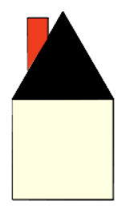

..  Copyright (C)  Mark Guzdial, Barbara Ericson, Briana Morrison
    Permission is granted to copy, distribute and/or modify this document
    under the terms of the GNU Free Documentation License, Version 1.3 or
    any later version published by the Free Software Foundation; with
    Invariant Sections being Forward, Prefaces, and Contributor List,
    no Front-Cover Texts, and no Back-Cover Texts.  A copy of the license
    is included in the section entitled "GNU Free Documentation License".

.. include:: ../CSP/csp_global.rst

Turtle Art
==============================

Below is a program to draw a simple house.

.. activecode:: cspnameturtles_turtleart1
    :nocodelens:

    from turtle import *
    space = Screen()
    bob = Turtle()
    bob.speed(8)

    # Make a square
    bob.fillcolor("light yellow")
    bob.begin_fill()
    bob.forward(100)
    bob.right(90)
    bob.forward(100)
    bob.right(90)
    bob.forward(100)
    bob.right(90)
    bob.forward(100)
    bob.end_fill()

    # Position for roof
    bob.right(90)

    # Make a roof
    bob.fillcolor("black")
    bob.begin_fill()
    bob.forward(100)
    bob.left(120)
    bob.forward(100)
    bob.left(120)
    bob.forward(100)
    bob.left(120)
    bob.end_fill()

Now we want to add a "chimney" to the house that looks something like this:

Modify the program above so that it draws a ``"red"`` chimney. You can either draw it before
or after drawing the roof.

 .. parsonsprob:: cspnameturtles_turtleart2
..    :numbered: left
..    :adaptive:

..    Align the program pieces below to make the house and chimney figure above.  Draw the square first for the main part of the house, next draw the roof, and finally draw the chimney.
..    -----
..    from turtle import * 
..    space = Screen()
..    bob = Turtle() 
..    =====
..    from turtle import * 
..    space = screen()
..    bob = turtle() #paired
..    =====
..    # Make a square
..    bob.forward(100) 
..    bob.right(90) 
..    bob.forward(100) 
..    bob.right(90) 
..    bob.forward(100) 
..    bob.right(90) 
..    bob.forward(100) 
..    =====
..    # Position for roof
..    bob.right(90)
..    =====
..    # Position for roof
..    bob.left(90) #paired
..    =====
..    # Make a roof
..    bob.forward(100)   
..    bob.right(-120)   
..    bob.forward(100)   
..    bob.right(-120)   
..    bob.forward(100) 
..    bob.right(-120)  
..    =====
..    # Position for chimney
..    bob.right(-60)
..    bob.forward(40)
..    bob.setheading(90) 
..    =====
..    # Draw chimney
..    bob.color("red")
..    bob.forward(30)
..    bob.right(90)
..    bob.forward(30)
..    bob.right(90)
..    bob.forward(30)
..    bob.right(90)
   
.. Let's make another square inside the house, to create a "window."

.. .. image:: Figures/turtle-house2.png
..    :width: 120 px
..    :align: center
   
 .. parsonsprob:: cspnameturtles_turtleart3
..    :numbered: left
..    :adaptive:

..    Align the program pieces below to make the house and window figure above.  Draw the square first for the main part of the house, next draw the roof, and finally draw the window.
..    -----
..    from turtle import * 
..    space = Screen()
..    bob = Turtle() 
..    =====
..    from turtle import * 
..    space = screen()
..    bob = turtle() #paired
..    =====
..    # Make a square
..    bob.forward(100) 
..    bob.right(90) 
..    bob.forward(100) 
..    bob.right(90) 
..    bob.forward(100) 
..    bob.right(90) 
..    bob.forward(100) 
..    =====
..    # Position for roof
..    bob.right(90)
..    =====
..    # Position for roof
..    bob.left(90) #paired
..    =====
..    # Make a roof
..    bob.forward(100)   
..    bob.right(-120)   
..    bob.forward(100)   
..    bob.right(-120)   
..    bob.forward(100) 
..    bob.right(-120)  
..    =====
..    # Position for window
..    bob.penup()
..    bob.goto(50,-30)
..    bob.pendown()
..    bob.setheading(0) 
..    =====
..    # Draw window
..    bob.color("red")
..    bob.forward(30)
..    bob.right(90)
..    bob.forward(30)
..    bob.right(90)
..    bob.forward(30)
..    bob.right(90)
..    bob.forward(30)
   

