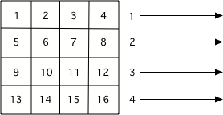
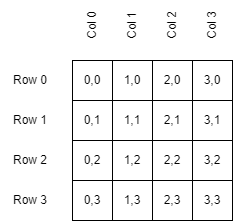
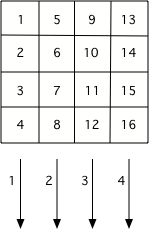

..  Copyright (C)  Mark Guzdial, Barbara Ericson, Briana Morrison
    Permission is granted to copy, distribute and/or modify this document
    under the terms of the GNU Free Documentation License, Version 1.3 or
    any later version published by the Free Software Foundation; with
    Invariant Sections being Forward, Prefaces, and Contributor List,
    no Front-Cover Texts, and no Back-Cover Texts.  A copy of the license
    is included in the section entitled "GNU Free Documentation License".
    
.. include:: ../CSP/csp_global.rst 

|image_defs| 

Thinking About Pixel Locations
======================================================

So far, we have been getting a list of all of the pixels from an image using ``img.getPixels()``
and then looping through all the pixels using ``for p in pixels:``. This processed all the
pixels in the first row, then all the pixels in the second row, and so on until it processed
all the pixels in the image.

    
    The order that pixels are processed if you use ``img.getPixels()``

This approach has some limitations because we never know what coordinates the pixel we are
working on is located at. This prevents us from writing programs that change where pixels are
or do different things in different parts of the image.

If we want to have access to the location of the pixel we are working with, we need to change
our loop strategy. We will use nested loops, with an outer one that iterates over all the columns
in the image and inner one that iterates over all of the rows in that column. This sample shows the
basic idea but just prints out the locations of pixels in the order they would be visited instead
of doing actual work on an image.

.. activecode:: csprepeatimages_changecolorloc1
    :nocodelens:

    imageWidth = 4
    imageHeight = 4

    for x in range(imageWidth):         # For each possible x coordinate
        for y in range(imageHeight):        # For each possible y at that x
            print("Working on pixel: " + str(x) + ", " + str(y))

Notice that we start counting from 0 in images (in programming we generally start counting
from 0 instead of 1). So the uppermost left pixel is 0, 0. The bottom left pixel in a 4 x 4
image is 3, 0.

    
    The x, y locations of various pixels in a 4 x 4 image. 

Since the outer loop in our program changes the  x (the column) and the inner loop changes
the y (the row), we will start on column 0. On that column, the inner loop processes all
the rows in that column. Then we move to column 1, where we process all of its rows...

    
    The order that pixels are processed if you use a nested loop with x changing in the outer
    loop and y changing in the inner loop.

.. mchoice:: csprepeatimages_changecolorloc2
    :answer_a: 4, 9
    :answer_b: 5, 10
    :answer_c: 9, 4
    :answer_d: 10, 5
    :correct: c
    :feedback_a: Remember that the width defines the possible x coordinates and the x comes first
    :feedback_b: Remember that the width defines the possible x coordinates and the x comes first
    :feedback_c: Correct. We start counting from 0, so a width of 10 means columns 0-9. A height of 5 means rows 0-4.
    :feedback_d: That would be true if the image had a width of 11 and a height of 6.
    
    In the program above, if we set ``imageWidth`` to be 10 and ``imageHeight`` to be 5, what
    would the coordinates of the last pixel processed be?

Now let's put the pixel coordinates to work. To do so, instead of printing coordinates like 0,0
we will use them to call ``getPixel`` on the image. In the past, our loop was given a big list of
all the pixels and iterated through those. Now we have two loops, that are iterating through all
the location in the image. We use those locations to get the pixels one by one.

The sample below dose exactly that. Then, after getting the pixel, it modifies the There
color channels (red, green, blue) of that pixel by subtracting the x coordinate. This means on
the left side of the image, where x is 0 or close to it, there is little change. On the right
side, where x is larger, we remove more and more of the color, getting closer and closer to
pure black. (Once we hit column 255, we could only get black as the starting red/green/blue
values are all 255 at most.)

.. activecode:: csprepeatimages_changecolorloc3
    :nocodelens:

    # STEP 1: USE THE IMAGE LIBRARY 
    from image import *
    
    # STEP 2: PICK THE IMAGE
    img = Image("student2.jpg")

    # STEP 3: LOOP THROUGH THE PIXELS
    for x in range(img.getWidth()):
    	for y in range(img.getHeight()):
        
            # STEP 4: GET THE DATA
            p = img.getPixel(x, y)      # Get pixel at location x, y
            r = p.getRed()
            g = p.getGreen()
            b = p.getBlue()
            
            # STEP 5: MODIFY THE COLOR
            p.setRed(r - x)             # Subtract column # from each color
            p.setGreen(g - x)
            p.setBlue(b - x)
                        
            # STEP 6: MODIFY THE IMAGE
            img.updatePixel(p)
                    
    # STEP 7: SHOW THE RESULT
    win = ImageWin(img.getWidth(), img.getHeight())
    img.draw(win)

We don't always have to modify the pixel color. We can also use the coordinates to move a particular
pixel to a new location. This sample calculates a ``newY`` that is used as the y coordinate for the
pixel when we put it back in the image. This ``newY`` is calculated as the height of the image
minus one minus the y location of where we got the pixel.

.. activecode:: csprepeatimages_changecolorloc4
    :nocodelens:

    # STEP 1: USE THE IMAGE LIBRARY 
    from image import *
    
    # STEP 2: PICK THE IMAGE
    img = Image("student2.jpg")

    # STEP 3: LOOP THROUGH THE PIXELS
    for x in range(img.getWidth()):
        for y in range(img.getHeight()):
        
            # STEP 4: GET THE DATA
            p = img.getPixel(x, y)
            
            # STEP 6: MODIFY THE IMAGE
            # Calculate a new Y location for the pixel 
            newY = (img.getHeight() - 1) - y
            # Write it to the image at (x, newY)
            img.setPixel(x, newY, p)
                    
    # STEP 7: SHOW THE RESULT
    win = ImageWin(img.getWidth(), img.getHeight())
    img.draw(win)
    

.. mchoice:: csprepeatimages_changecolorloc5
    :answer_a: We rotated the image 90 degrees to the left and flipped it over.
    :answer_b: We mirrored the image around a horizontal line.
    :answer_c: We flipped the image horizontally.
    :answer_d: No change.
    :correct: b
    :feedback_a: This would be true if we created a new image and set the values in the new image from the old pixel values.
    :feedback_b: Correct. The top rows are copied to the bottom and end up erasing the top part of the image.
    :feedback_c: This would be true if we created a new image and set the values in the new image from the old pixel values.
    :feedback_d: Compare this image to the original student2.jpg image.

    What happened when we copied the pixel from (x,y) to (x, newY)?

Say an image has a height of 10. When y is 0 (top row), newY will be :math:`(10 - 1) - 0 = 9`
which is the last row in the image. When y is 1, newY will be: :math:`(9 - 1) - 0 = 8`, or
the next to last row in the image. So the top row gets copied to the bottom. The second row
gets copied to the row above that, etc...

Unfortunately, as we move rows from the top to the bottom, we lose the data that used to be there.
So once we get to the bottom half, we are copying data that was copied from the top half back
to its starting location. If we want to fix that problem, we need to copy our data from one Image
to another so that we don't wipe out the original as we make changes. This program does exactly
that - it copies from ``imgSource`` to ``imgTarget`` and then draws ``imgTarget`` when it is done.
``imgSource`` never changes - to verify that, after running the program, try changing the last
line to draw ``imgSource`` instead of ``imgTarget``.

.. activecode:: csprepeatimages_changecolorloc6
    :nocodelens:

    # STEP 1: USE THE IMAGE LIBRARY 
    from image import *
    
    # STEP 2: PICK THE IMAGE
    # first copy we will read from
    imgSource = Image("student2.jpg")
    # load a second copy we will write to
    imgTarget = Image("student2.jpg")

    # STEP 3: SELECT THE DATA
    for x in range(imgSource.getWidth()):
        for y in range(imgSource.getHeight()):
        
            # STEP 4: GET THE DATA
            p = imgSource.getPixel(x, y)
            
            # STEP 6: CHANGE THE IMAGE
            # Calculate a new Y location for the pixel 
            newY = (imgSource.getHeight() - 1) - y
            # Write the data to a copy of the image
            imgTarget.setPixel(x, newY, p)
            
    # STEP 7: SHOW THE RESULT
    win = ImageWin(imgTarget.getWidth(), imgTarget.getHeight())
    imgTarget.draw(win)
