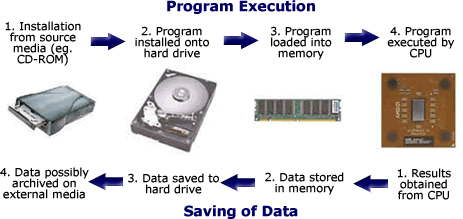
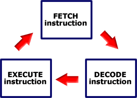

.. include:: ../global.rst

.. index:: 
    single: fetch, decode, execute
    pair: machine; cycle

The Machine Cycle
=================================

When software is installed onto a modern day personal computer (by downloading it from the Internet or installing off a disk), code comprising the program and any associated files is stored on the hard drive. This code comprises of a series of instructions for performing designated tasks, and data associated with these instructions. The code remains there until the user chooses to execute the program in question, on which point sections of the code are loaded into the computers memory.

In this tutorial, we are focusing on the step 4 in the diagram above - the process of getting instructions from main memory to the CPU and executing them. This process consists of three stages: fetching the instruction, decoding the instruction, and executing the instruction - these three steps are known as the **machine cycle**. A processor spends all of its time in this cycle, after executing an instruction it simply fetches the next instruction and gets to work on it.

* Fetch
    In the fetch cycle, the control unit looks at the program counter register (PC) to get the memory address of the next instruction. It then requests this instruction from main memory and places it in the instruction register (IR).

* Decode
    Here, the control unit checks the instruction that is now stored within the instruction register (IR). It looks at the instruction - which is just a sequence of 0s and 1s and decides what needs to be done. Does the instruction say to add two numbers? Does it say to load a value from memory? Where in memory? The control unit interprests the binary instruction to answer questions like these.

* Execute
    Now the control unit sends the signals that tell the ALU, memory, and other components signals to cause them to perform the correct work.

The animation below demonstrates a simple program running on computer. This imaginary computer shown uses special registers to hold memory address (MAR) and data that just came in from memory (MBR). It also uses registers called AL and BL to hold values temporarily. Don't worry about the details of those other registers, focus on the fetch/decode/execute cycle and how the PC and IR are used.

.. figure:: Images/MainAnimation.swf
    :alt: Instruction Cycle    
    :width: 100%
    :height: 400
    
    ..
    
    Press the green play button to start the animation.

.. attribution::  
    :title_1: Microprocessor Tutorial
    :title_link_1: http://www.eastaughs.fsnet.co.uk/
    :author_1: Matthew Eastaugh