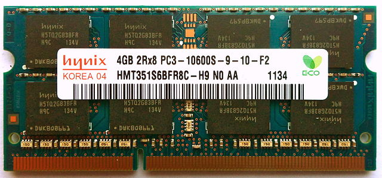

.. include:: ../global.rst

.. index:: main memory; memory; RAM

Main Memory
=================================

.. figure:: Images/memory.png
    :figclass: align-right
    :alt: Main Memory
    :figwidth: 250
    
    .. 
    
    Main memory is a sequence of bytes, each with a unique address.
    
Main memory consists of a very long list of bytes (groups of 8 bits). When the computer's power is on, every byte contains some pattern or other, even those bytes not being used for anything. (Remember the nature of binary: when a binary device is working it is either "on" or "off", never in-between.) Sometimes people will say that each memory location holds an eight bit binary number. This is OK, as long as you remember that the "number" might be used to represent a character, or anything else. Remember that what a particular pattern represents depends on its context (how a program is using it.) You cannot look at an arbitrary bit pattern (such as those in the picture to the right) and say what it represents.

Each byte has an address that is used to locate it. These addresses, like everything a computer works with are just binary numbers themselves, but when humans have to deal with these addresses, they are usually displayed as hexadecimal values. 

Addresses start from 0 and count up - this is shown in the picture above. The first byte is byte 0 (:math:`{0000000}_{2}` or :math:`{00}_{16}`), the next byte 1 (:math:`{01}_{16}`) and so on up to byte 254 (:math:`{11111110}_{2}` or :math:`{FE}_{16}`) and byte 255 (:math:`{FF}_{16}`). 

.. note:: A 0x written in front of a number is an alternative way to say "this is hexadecimal". This is a popular convention in programming languages and tools where you can't really put a subscript :math:`_{16}` after values.

The highest possible address depends on both the computer's hardware and operating system. Although the picture to the right only shows addresses that consist of 2 hex digits (which correspond to 8 bits) and thus only go up to 255, most computers use addresses that are much longer, often 32 or 64 bits long (8 or 16 hexadecimal digits) and thus can address billions of different bytes.

    
    `Image via Wikipedia Commons <http://simple.wikipedia.org/wiki/Random-access_memory#mediaviewer/File:4GB_DDR3_SO-DIMM.jpg>`__ - `Creative Commons CC BY SA 3.0 <http://creativecommons.org/licenses/by-sa/3.0/>`__
    
    A stick of RAM memory that might go in a laptop computer.

The processor can only do two fundamental things with in main memory:

* It can write to a byte at a given memory location. The previous bit pattern in that location will be destroyed.
* It can read a byte from a given location. The processor gets the bit pattern stored at that location and the contents of that location are NOT changed.

A processor can usually not access a single bit, instead, it must read a whole byte at a time. If a processor wants to work with a value larger than 8 bits (say a 32 bit integer), that value will be stored across multiple bytes. Thus in the image shown above, address 0x00 might refer to single byte (01001010) that represents something like a character, or it might be the first part of a 4 byte sequence(01001010 10111010 01011111 00100100) that spans addresses 0x00-0x03 and represents one large 32 bit value. Keeping track of how the bytes of memory are being used and what they represent is a critical job of the software running on a computer.

.. quick_attribution:: ICSJava