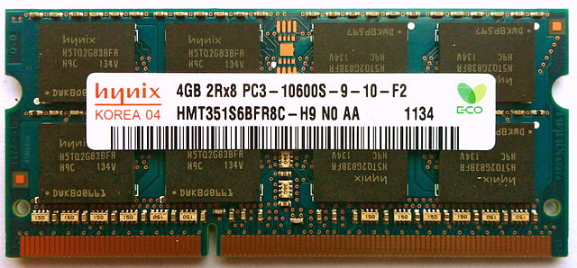

.. include:: ../global.rst

Memory Hierarchy
=================================

In an ideal, simple computer there would only be one memory - the main memory. That memory would be instantaneously accessible, allow permanent storage, require minimal energy, be compact and cheap. Unfortunately, there is no technology that offers all those features. Real-world constraints force computer engineers to use multiple different technologies, using each for the kind of thing it is best suited for. These different technologies form the **memory hierarchy** - a series of layers from small and fast to large and slow.

.. figure:: Images/Memory-Hierarchy.jpg
    :alt: Memory Hierarchy
    
    `Image via teachbook.com.au <http://blog.teachbook.com.au/index.php/2012/02/memory-hierarchy/>`__
    

.. pseudo_h4:: Registers

The small memory location on the CPU itself. Because the memory is right on the CPU, and because of the way it is engineered, it provides basically instant access to the information it contains. But because the space on the CPU is limited, the real estate there is very valuable and there is generally not much room for registers. At any time, only the most important set of information (current instruction and a few pieces of data) is in the registers.

.. pseudo_h4:: Cache

This is special memory is smaller and faster than the normal main memory and that is housed closer to the CPU. It maintains a copy of parts of main memory, allowing quicker access to some information. As far as the logic of a program goes, the cache doesn't really exist... we always request information from main memory (RAM). The cache just makes it so that sometimes those memory requests come back extra fast. Lots of engineering goes into figuring out how the computer should decide what is important enough to get cached.

.. pseudo_h4:: RAM - Main Memory (Physical Memory)

The "normal" main memory that we saw on the previous page. It generally runs significantly slower than the CPU - oftentimes hundreds of times slower. Thus each time the CPU has to access main memory, it can represent a significant slowdown. RAM generally needs to have power to maintain its state; when the power is turned off, it forgets the information it is storing. 
 

    
    `Image via Wikipedia Commons <http://simple.wikipedia.org/wiki/Random-access_memory#mediaviewer/File:4GB_DDR3_SO-DIMM.jpg>`__ - `Creative Commons CC BY SA 3.0 <http://creativecommons.org/licenses/by-sa/3.0/>`__
    
    A stick of RAM memory that might go in a laptop computer.

.. pseudo_h4:: Secondary Memory

Because main memory is generally built with circuits that need power, it cannot store information while the computer is off. Secondary memory is the general term for things like solid-state drives, hard drives, CD drives, flash drives, etc... that can store information long term. (Bottom two levels of the pyramid above). Not only can they retain information without power, they also generally provide better density - you can store more information in less space and with less cost. Unfortunately, these technologies are all slower than main memory. Information stored in secondary memory must be loaded into main memory (RAM) before the processor can access it - when you wait for a program to start up, a big part of what you are waiting on is the needed information to be transferred from a slower hard drive to the fast RAM that the processor can talk to.

    