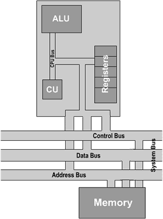
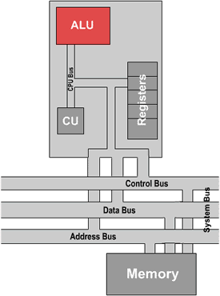

.. include:: ../global.rst

.. index:: ! von Neumann architecture, processor

The Processor
=================================

This basic model of a computer as a processing unit that takes input, communicates with a memory and produces output is know as the **von Nuemann architecture** after the early computer scientist :ref:`John von Neumann <vonNeumann>`. In this architecture, the processor itself consists of multiple specialized parts:

    
    
* The **arithmetic logic unit** (ALU) - the central processing unit that can perform mathematical and logic operations.
* The **control unit** that directs the movement of instructions in and out of the processor, and sends control signals to the ALU to make it perform the correct operation at any given point in time.
* The processor **registers** - small special purpose storage areas used to store the information the ALU is working with.
* The memory unit - not part of the processor - holds both data and instructions (program). To be used, this information must be transfered to registers. 

Modern computers vary add many layers of complexity to this basic model. One such modification seen in the picture above is multiple busses - in the diagram on the previous page and the original von Neumann architecture, there is only one system bus that can carry messages from one component to another. This means that the processor and memory would have to take turns talking: "CPU: Please send me the data at address 1 in memory"; "Memory: OK, the data at 00001 is 01010111."; "CPU: Please send me the data at address 2 in memory"... Having multiple busses avoids this bottleneck by allowing the CPU tell memory the next address it wants at the same time memory sends data back to the CPU.

.. index:: ALU

.. pseudo_h3:: The ALU
    :class: underlined
    

    
The arithmetic logic unit is the circuits that can do math and logic. Early processors could only do very simple operations - add an subtract numbers, compare two numbers to see which is larger, and perform manipulations using Boolean logic rules (being able to say do logical OR on two input patterns). More complex operations, like say multiplication might have to be performed via simpler operations that the ALU can do directly. Instead of multiplying two numbers, a very simple computer would have to add them repeatedly. 

As components became smaller, more and more logic could be built into ALUs - from circuits to do multiplication, to circuits to work with floating point decimals or process text. Now days, almost every processor has multiple ALUs that work in parallel and are often specialized for specific jobs.

.. attribution::  
    :title_1: Microprocessor Tutorial
    :title_link_1: http://www.eastaughs.fsnet.co.uk/
    :author_1: Matthew Eastaugh