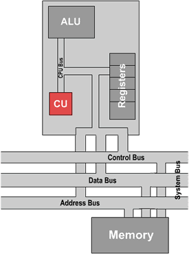
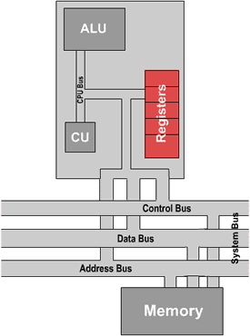

.. include:: ../global.rst

.. index:: von Neumann architecture

The Processor, cont.
================================= 

.. index:: control unit

.. pseudo_h3:: The Control Unit
    :class: underlined

The control unit is the true "brain" of the CPU and is responsible for controlling much of the operation of the rest of the processor. It does this by issuing control signals to the other areas of the processor, instructing them on what should be performed next. Similarly to the arithmetic logic unit, the control unit can be broken down further for easier understanding. Two key sub-components are the decoder and clock:

.. pseudo_h4:: Decoder

Like everything else the computer works with, instructions are represented as sequences of 0s and 1s. The decoder is the logic that examines those bits and determines what actions must be taken to execute the instruction they represent. The control unit uses this information to send the appropriate series of messages to the ALU, memory, and registers.

.. pseudo_h4:: Timer or clock

The timer or clock ensures that all processes and instructions are carried out and completed at the right time. If one component of the computer tries to read a signal before another component has sent the message it might see an older message or complete gibberish. Pulses are sent to the other areas of the CPU at regular intervals and actions only occur when a pulse is detected.

.. _registers:

.. pseudo_h3:: Registers
    :class: underlined

A register is a memory location within the CPU itself, designed to be quickly accessed for purposes of fast data retrieval. These contain instructions, data and other values that are needed by the ALU and control unit. On the timescale processors work at (billionths of a second) the trip to main memory can be too slow to wait for during the middle of an instruction. So the CPU needs some high-speed memory right inside the CPU to store the information it is currently working with. Here are some examples of kinds of registers a CPU  will often have:

.. pseudo_h4:: Instruction Register (IR)

This is used to hold the current instruction in the processor while it is being decoded and executed. As each instruction that is to be executed is fetched from memory it is placed here for quick reference.

.. pseudo_h4:: Program Counter (PC)

This register is used to hold the memory address of the instruction being executed. This is how the CPU keeps track of where it is in the program ("I am on instruction 010101"). Normally, each time an instruction is executed, the PC is increased by one to move to the next instruction. Sometimes, however, an instruction will modify the PC to make the program jump to a completely different instruction.

.. pseudo_h4:: General Purpose Registers

A simple computer might have one Accumulator (ACC) that is used to hold the result of operations performed by the ALU. (We will see an example of such a machine in :ref:`The Little Computer<little-computer>`). Modern processors have anywhere from a few to dozens of these registers for storing the results of work directly in the CPU. The names of these general-purpose registers will differ from one machine to another, but no matter what they are called, they simply are very fast, very temporary storage for the CPU.

.. attribution::
    :title_1: Microprocessor Tutorial
    :title_link_1: http://www.eastaughs.fsnet.co.uk/
    :author_1: Matthew Eastaugh
