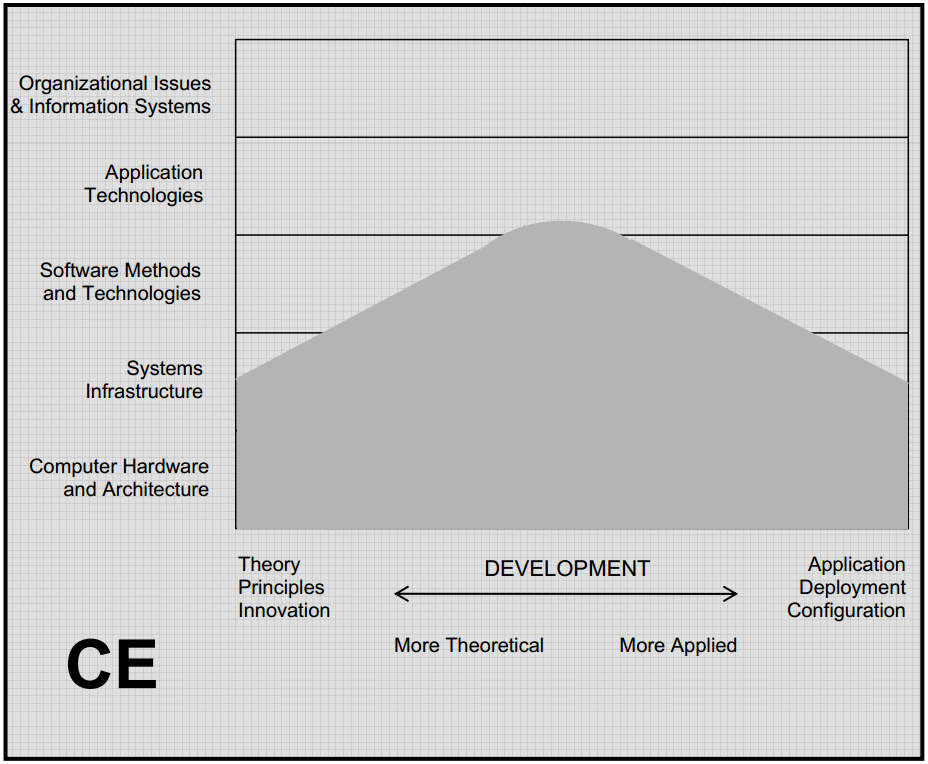

.. include:: ../global.rst

.. index:: computer engineering

Computer Engineering
=====================================

C\ **omputer Engineers** research, design, develop and test computer chips, circuit boards, computer systems, and related equipment such as keyboards, modems, and printers…. They need to understand computer programming, as they are the ones who design the hardware that runs the programs, but in general their work is more focused on the hardware itself.

The graph below shows the range of expertise of a Computer Engineers. There is broad coverage across the bottom because computer engineering includes everything from the theory to the practical 
application of computing hardware. It narrows towards the 
center as we move upwards because a computer engineer’s interests narrow as we move away from the 
hardware. A computer 
engineer needs an understanding of software development, but not its the theoretical aspects or practical application.

   
   `ACM Computing Curriculum report <http://www.acm.org/education/education/curric_vols/CC2005-March06Final.pdf>`__
   
    

**Typical careers:**

* `Computer engineer <http://www.bls.gov/ooh/architecture-and-engineering/computer-hardware-engineers.htm>`__

**Education:**

* To work in this field you need a Bachelor's degree in Computer Engineering. At some schools, instead of a separate Computer Engineering degree, students specialize in that field while earning a degree in Electrical Engineering.
* At Chemeketa, `Mark Miller <http://www.chemeketa.edu/programs/drafting/documents/TransferEngineering.pdf>`__ in the Engineering department offers two year sequences designed to help students transfer to 4-year engineering programs.

.. quick_attribution:: ACM 
