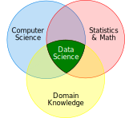

.. include:: ../global.rst

.. index:: data science

Data Science
=====================================

**Data Science** is a new, and rapidly growing inter-disciplinary field of study. It
focuses on using a combination of computation and mathematics to answer questions and
solve problems using large amounts of data. 

A data scientist will be responsible for gathering data and then using it to find trends,
make forecasts, and communicate information. To do this, they will write computer programs,
apply various mathematical techniques from statistics, calculus, and linear algebra, and
make use of advanced tools like machine learning algorithms.

Although there are a general set of skills used by all data scientists, an individual
data scientist often focuses on a particular domain. They may specialize in working with
data from biological sciences, business and marketing, sports management, 
geology, or in any other domain where large amounts of data exist. To effectively work
in one of these domains, a data scientist often needs field-specific knowledge in addition
to their general data science skills.

**Typical careers:**

#. `Data Scientist or Data Analyst <https://www.coursera.org/articles/what-is-a-data-scientist>`__

**Education:**

Working as a data analyst or scientist generally requires a Bachelor's degree or graduate
degree (Master's or Ph.D.).

Because Data Science is a cross-disciplinary field, degrees in data science can be found 
in many different programs. Some Data Science degrees are offered by math departments, others
as concentrations in a degree in computer science. And specialized data science programs may
exist in other departments - a biology department may offer a degree in "Bio Informatics" or
"Biological Data Science".

Any data science degree is probably going to feature:

* A solid foundation in programming and algorithms.
* Mathematics including statistics and likely calculus and linear algebra.
* Exposure to the techniques and tools used in data science.

    Data Science combines mathematics, computer science, and knowledge in a domain.