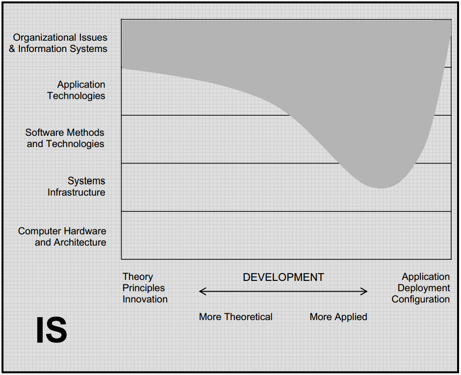

.. include:: ../global.rst

.. index:: information Systems

Information Systems
=====================================
 
In some ways **Information Systems** attacks the same basic problem as Information Technology, "how should we use technology to support businesses and organizations?" However, while IT is more concerned with the technology side of the problem, Information Systems comes at the problem from the business side. They are interested in questions like: "What information does the enterprise need?", "How is that information generated?", "Is it delivered to the people who need it? Is it presented to them in ways that permit them to use it readily?"

Information Systems degrees generally have a blend of courses in technology, business, and communications.  IS professionals must understand both technical and organizational factors so they can serve as a bridge between the technical and management groups in an organization. The graph below shows this expected range of knowledge: a thorough knowledge of how to understand and meet business needs, with enough knowledge of applications and software development to make knowledgeable decisions about how to use those tools

   
   `ACM Computing Curriculum report <http://www.acm.org/education/education/curric_vols/CC2005-March06Final.pdf>`__
   
    
**Typical careers:**

#. `Computer Systems Analyst <http://www.bls.gov/ooh/computer-and-information-technology/computer-systems-analysts.htm>`__
#. `Information Security Analyst <http://www.bls.gov/ooh/computer-and-information-technology/information-security-analysts.htm>`__

**Education:**

* Students interested in Information Science careers should talk to Mandy Reininger in the `Computer Information Systems <http://www.chemeketa.edu/programs/computer/cis_program.html>`__ department at Chemeketa. They offer multiple certificate and two year degree programs.
* Because IS jobs tend to be "big picture" management, they are more likely to require a Bachelor's degree than IT jobs. Local options include: `Western Oregon's Information Systems <https://www.wou.edu/las/cs/babsis.php>`__ degree and `OIT's Business/Systems Anaylsis <http://www.oit.edu/academics/degrees/information-technology>`__ IT degree.

.. quick_attribution:: ACM 
