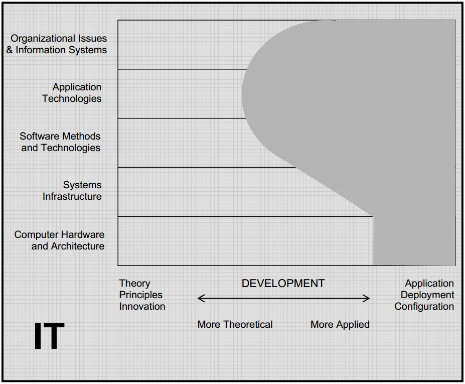

.. include:: ../global.rst

.. index:: information technology

Information Technology
=====================================
 
Although sometimes the term "Information Technology" is used to refer to anyone who works with computers, it also has a more specific meaning - the skill set required to put computers to work in a business or other organization. If Computer Science is more about learning to build new technology, **Information Technology** is more about learning how to take existing computer technology and put it to use.

IT professionals have the responsibility for selecting hardware and software products appropriate for an organization. They integrate those products with organizational needs and infrastructure, and install, customize and maintain those applications, thereby providing a secure and effective environment that supports the activities of the organization’s computer users. In IT, programming often involves writing short programs that typically connect existing components (scripting).

Below is shown the expected skills in an IT graduate. They need wide expertise of skills in terms of deploying and applying technology and working with users. They also need some experience with developing solutions so they understand how to make the modifications required to get customize tools to the needs of a particular job. This knowledge is usually focused on a particular area - databases, system administration, web design, networking, etc...

   
   `ACM Computing Curriculum report <http://www.acm.org/education/education/curric_vols/CC2005-March06Final.pdf>`__
   
    
**Typical careers:**

#. `Network and Systems Administrator <http://www.bls.gov/ooh/computer-and-information-technology/network-and-computer-systems-administrators.htm>`__
#. `Information Security Analysts <http://www.bls.gov/ooh/computer-and-information-technology/information-security-analysts.htm>`__
#. `Database Administrator <http://www.bls.gov/ooh/computer-and-information-technology/database-administrators.htm>`__
#. `Computer Support Specialist <http://www.bls.gov/ooh/computer-and-information-technology/information-security-analysts.htm>`__

**Education:**

* Students interested in Information Technology careers should talk to Mandy Reininger in the `Computer Information Systems <http://www.chemeketa.edu/programs/computer/cis_program.html>`__ department at Chemeketa. They offer multiple certificate and two year degree programs.
* Although many areas of IT are open to anyone with a certificate or two year degree, positions with more responsibility may require a Bachelor's degree. OIT offers Bachelor's degrees in `Information Technology <http://www.oit.edu/academics/degrees/information-technology>`__.

.. quick_attribution:: ACM 
