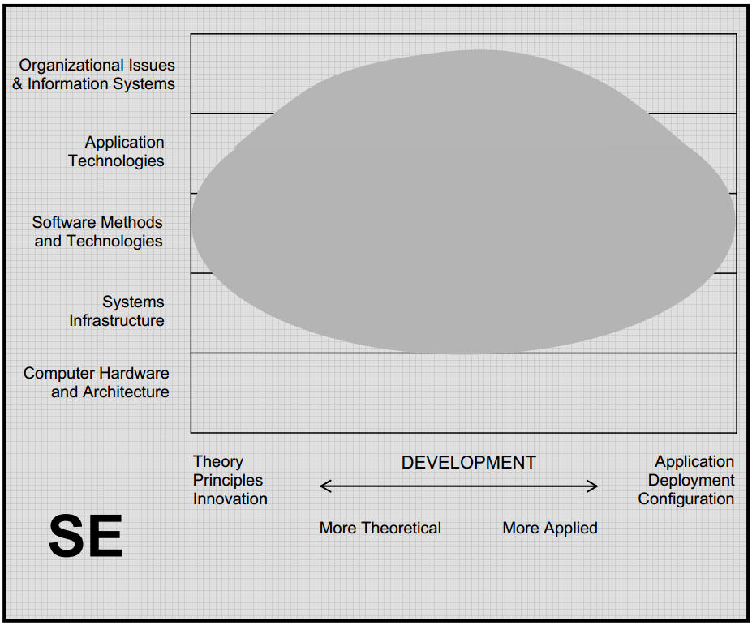

.. include:: ../global.rst

.. index:: software engineering

Software Engineering
=====================================
 
S\ **oftware engineering** is concerned with developing and maintaining software systems that behave reliably and efficiently, are affordable to develop and maintain, and satisfy the requirements of the users. It has developed to meet the needs of industry for graduates capable of working in teams on large software systems.

Like computer science, software engineers need a strong foundation in programming fundamentals and basic computer science theory. After that similar start, Software Engineering programs generally have a well defined sequence of courses focusing on the skills needed to develop reliable software in an efficient manner (problem modeling and analysis, software design, software verification and validation, development process management). While both CS and SE programs typically require students to experience team project activity, SE programs tend to involve the students in significantly more of it.

Although some schools offer degrees specifically in Software Engineering, at most schools it exists as a specialization within the computer science department. Someone who knows they want to become a working software developer thus would focus on that sequence of courses instead of picking a more theoretical area to specialize in.

A software engineer is expected to have expertise in software development ranging from theoretical, through development and deployment and configuration. They are also expected to have an understanding of how to develop the system architectures that programs run on and how the needs of an organization affect the software development process. The graph below shows this range of expected expertise.

   
   `ACM Computing Curriculum report <http://www.acm.org/education/education/curric_vols/CC2005-March06Final.pdf>`__
   
    

**Typical careers:**

#. `Software Developer <http://www.bls.gov/ooh/computer-and-information-technology/software-developers.htm>`__

**Education:**

* OIT offers the only Software Engineering Bachelor's degree in the Oregon public universities. At other schools software engineering is something a student studies within computer science. There are also a few Master's programs in Software Engineering.
* At Chemeketa, SE students take the same basic core of classes as CS students in order to transfer to a 4-year school to complete a Bachelor's. `Andrew Scholer <http://faculty.chemeketa.edu/ascholer/>`__ is the person to contact about preparing for transferring into a SE program.

.. quick_attribution:: ACM 
