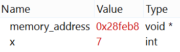

.. include:: ../global.rst

Hex Data & Colors
============================

Hexadecimal is used to display large binary values for people to read. Although all data is stored as binary, for many pieces of data a computer works with, the 1s and 0s have a meaning defined by their data type; the computer interprets a sequence of 1s and 0s as a signed integer, or an ASCII character, or a floating point decimal. But some pieces of information do not have a natural type. Things like memory addresses in a computer are just binary sequences (00000, 00001, etc...). When a computer has to display data that does not have a "type" or for which the type is unknown, the raw information is typically shown in hexadecimal.

   
   ..
   
   A programmers view of two pieces of information in a program. 

The image above shows a screen shot of looking at data while debugging a computer program. **x** is known to be an integer (int) - so the bits that store its value (00000000000000000000000000000111) are interpreted as the decimal number 7. **memory_address** is a memory address for an unknown type (void *) - so its bits (001010001111111010111000) are displayed in hex as 28feb8.

.. index:: hex colors
 
The first place many people encounter hexadecimal is learning about specifying colors for websites. Colors are generally specified as 24-bit numbers - 8 bits each to represent how much red, green and blue. These 8 bits are enough to give values of :math:`{0-255}_{10}` (:math:`{00000000-11111111}_{2}`) for each of the three primary colors. To make different colors, we mix different amounts of the three primaries. 255 red, 0 green, 140 blue makes a :pink:`nice pink`. To specify this color, a website designer can write the 24 binary digits as 6 hex digits (remember that 4 binary digits correspond to one hex digit). 255 is FF in hex. 0 is 00 in hex. 140 is 8D in hex. So :pink:`this shade of pink` can be written as FF008D - a website designer would type something like "color: #FF008D;" to specify that some text should be pink.

You can play with the sliders below to explore how colors can be described as a mix of red, green and blue. Move the sliders to change the amount of each color. The current value is displayed in both decimal and hexadecimal. By writing the hex digits for each color as one 6 digit number (red/green/blue), you can determine the hex code for the color - which is shown below the color swatch.

.. raw:: html
    
    
      
    </head>
    <body class="ui-widget-content" style="border:0;">
     
    

    

            <input type="text" class="colorVal" id="redVal" readonly="true" />

    

            <input type="text" class="colorVal" id="greenVal" readonly="true" />

    

            <input type="text" class="colorVal" id="blueVal" readonly="true" />

    

    

    

    
Hex color code:<input type="text" id="colorName" readonly="true" />

    

    
.. pseudo_h4:: Self Check 
    :class: underlined
 
.. mchoicemf:: hexcolors_1 
    :answer_a: A255A2
    :answer_b: 58B3B3
    :answer_c: 43C0C0
    :answer_d: 777777
    :correct: b
    :feedback_a: Try reproducing the color with the tool above
    :feedback_b: 
    :feedback_c: Try reproducing the color with the tool above
    :feedback_d: Try reproducing the color with the tool above
    
    Which of the following hex values describes a smoky-aqua color?
    
.. fillintheblank:: hexcolors_2
   :correct: \\b000000\\b
   :feedback1: ('[^0-9A-Fa-f]+', 'Your answer should consist of hex digits: 0-9, A, B, C, D, E, F',)
   :feedback2: ('\\b.{1,5}\\b', 'That is not enough digits')
   :feedback3: ('\\b.{7,}\\b', 'That is too many digits')
   :feedback4: ('.*', 'Hint: Try reproducing the color with the tool above')
   :blankid: hexcolors_2_ans1

   What hex code specifies black? :textfield:`hexcolors_2_ans1::large`

   