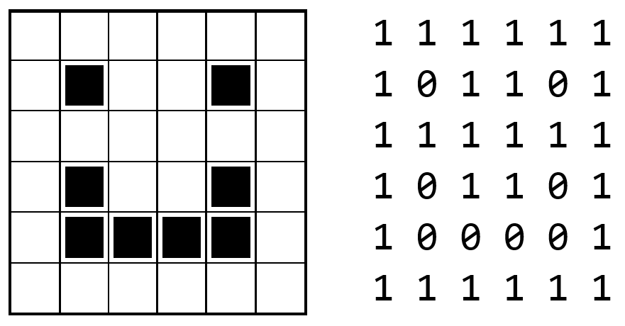
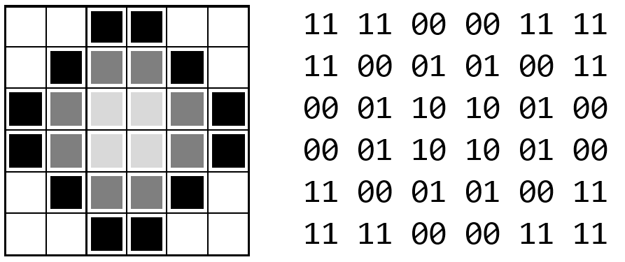
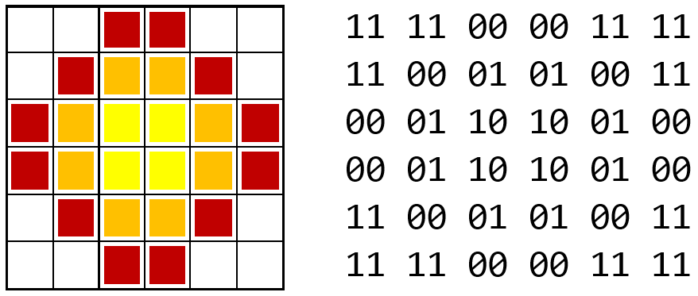

.. include:: ../global.rst

Representing Images
======================================================

Images can be represented in multiple ways - the most common being as a grid of little squares called **pixels**. In a very simple image that was only black and white, we could think of each pixel as being represented by a 0 (black) or 1 (white). Thus this image:

Could be stored as a binary string of 36 bits: 111111101101111111101101100001111111. To successfully draw the image from that pattern, we would have to know to interpret those series of binary digits as 6 rows of 6 pixels (and not say 4 rows of 9 pixels), so real image file formats often include extra information like the dimension of the image.

In images, we often want to represent shades of gray or colors. To do so, each pixel can be assigned more than one bit. If each pixel is given a value consisting of 2 bits we can have 4 colors:

* 00 black
* 01 dark gray
* 10 light gray
* 11 white

Using that scheme, we could make a shaded circle like this:

Representing that image takes 72 bits - a 6x6 grid of pixels each of which requires 2 bits. Once again, to draw the image from the bits we would need to know the dimensions of the image; but now, we also would need to specify the number of bits used for each pixel. Those 72 bits could represent a 3x6 image where each pixel is represented with 4 bits (with 4 bits we could represent :math:`2^4 = 16` different shades of gray).

.. important::

    *A pattern of bits only has the meaning we assign to it.*

    32 bits could represent a 4x8 image of 1-bit pixels, or a 4x4 image of 2-bit pixels, or a sequence of 4 ASCII letters, or a really large binary number, or nearly anything else.

What about colors? Remember, bits only have the meaning we assign to them. We could interpret the 2 bits per pixel to mean:

* 00 red
* 01 orange
* 10 yellow
* 11 white

And end up with this image:

If we want more than 4 colors, we just need more than 2 bits. With 8 bits per pixel, we can represent :math:`2^8 = 256` different colors or shades of gray. This is sufficient for a black and white photograph but does not allow for subtle shades of color in a photograph. For full color images, 24 bits are usually used per pixel, allowing for :math:`2^{24} = 16,777,216` different colors.

Real images, of course, use a much greater number of pixels than we have seen here. For example, a 12-megapixel camera takes images that measure about 4000x3000 pixels. If each of those pixels is stored as a 24-bit value, that image would consist of 4000 x 3000 x 24 = **288,000,000 bits of information**! That is 36,000,000 bytes or approximately 34.3 MiB. However, if you were to look at an image file produced by this camera, you would find it to be much smaller than 34 MiB even though the file stored extra information beyond the contents of each pixel (the dimensions of the image, how may bits per pixel, etc...). This is because the image has been compressed - most common image formats (gif, jpeg, png) include some form of compression to reduce the space needed to store their information... a topic we will learn more about later.

.. pseudo_h4:: Self Check
    :class: underlined

.. fillintheblank:: datarepresentation_imagerepresentation1

    How many bits would a 10x20 image with 8 different possible colors per pixel require? (Hint: how many bits are required to represent 8 different colors)

    - :600: Correct!
      :[\D]+: The answer should be just numeric digits
      :.{1,2}: Not enough digits
      :.{4,}: Too many digits
      :x: (length x width) x bits per pixel
