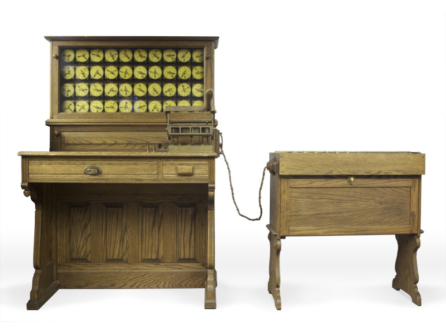

.. include:: ../global.rst

.. index:: Difference Engine, Analytical Engine
.. index:: 
    single: Babbage, Charles
    single: Lovelace, Ada

Dawn of Computers
------------------------

.. sidebar:: Charles Babbage

   .. raw:: html
   
        <a target="_blank" class="my-video-overlay" href="http://www.computerhistory.org/revolution/calculators/1/51/2205"></a>
Computer History Museum

False Dawn: The Babbage Engine

C\ **harles Babbage**, an English mechanical engineer and polymath, originated the concept of a programmable computer. Considered the "father of the computer", he conceptualized and invented the first mechanical computer in the early 19th century. In 1823, on a commission from the British government, he began designing and building the the **Difference Engine** to calculate values for polynomial functions. After working on the machine for ten years he realized that a much more general design that could be instructed to perform arbitrary computations was possible and began to focus on that project. 

.. figure:: Images/Difference_engine_plate_1853.jpg
   :alt: The Difference Engine
   :figwidth: 60%
   
   ..
   
   Diagram of a portion of the Difference Engine

.. index:: Analytical Engine
   
Whereas the Difference Engine could only calculate the values of polynomial functions, the new **Analytical Engine** would be able to do any calculation. The Engine incorporated an arithmetic logic unit, control flow in the form of conditional branching and loops, and integrated memory, making it the first design for a general-purpose compute. Input of both programs and data was to be provided to the machine via punched cards, a method being used at the time to direct mechanical looms such as the Jacquard loom. Punch cards were to remain the dominant way of `feeding a program into a computer <https://www.youtube.com/watch?v=KG2M4ttzBnY>`__ until the 1970's.
 
.. container:: inlinegroup

    .. figure:: Images/jacquardcards.jpg
       :alt: Abacus
       :figwidth: 45%
       
       ..
       
       A Jaquard punchcard with loom patterns from the 1800's
       
    .. figure:: Images/punch_card.jpg
       :alt: Abacus
       :figwidth: 45%
    
       Image courtesy of Computer History Museum.
       
       1960's Era computer punch card
       
       
.. sidebar:: Ada Lovelace

    .. image:: Images/Ada_Lovelace_portrait.jpg
        :alt: Ada Lovelace

|br|        
        
**Ada Byron Lovelace** collaborated with Babbage on documenting the Analytical Engine. She is often credited as the first programmer, having developed the first algorithm - one to calculate `Bernoulli numbers <http://en.wikipedia.org/wiki/Bernoulli_number>`_ - specifically designed to run on a general computational device. She also saw the potential for calculation to be applied to tasks other than strict number crunching:

    The Analytical Engine might act upon other things besides number, were objects found whose mutual fundamental relations could be expressed by those of the abstract science of operations, and which should be also susceptible of adaptations to the action of the operating notation and mechanism of the engine...

    Supposing, for instance, that the fundamental relations of pitched sounds in the science of harmony and of musical composition were susceptible of such expression and adaptations, the engine might compose elaborate and scientific pieces of music of any degree of complexity or extent.

    
Babbage was a man ahead of his time - manufacturing the fine clockwork mechanisms required for hs Engines was impossible with current technology. Neither engine was ever completed in his lifetime. But sixty years after Babbage developed the idea of the Analytical Engine, another inventory would successfully build a machine that would transform the way governments and businesses processed information.

.. index:: Hollerith Machine
.. index:: 
    single: Hollerith, Herman
    
The 1880 census had taken seven years to process and it was estimated that the 1890 census would take approximately 13 years to complete. Since the U.S. Constitution mandates a census every ten years, that meant the data would be obsolete before the results were available. **Herman Hollerith** invented a machine that could be used to tabulate data on punchcards, that could then easily be sorted or tallied mechanically. Using this machine, the 1890's census was completed in just one year. This success sparked a revolution in business data processing - the company that Hollerith founded would merge with three other companies to become International Business Machines (IBM).

   Image courtesy of Computer History Museum.
   
   A replica of the Hollerith tabulating desk
   

.. quick_attribution:: Wikipedia 