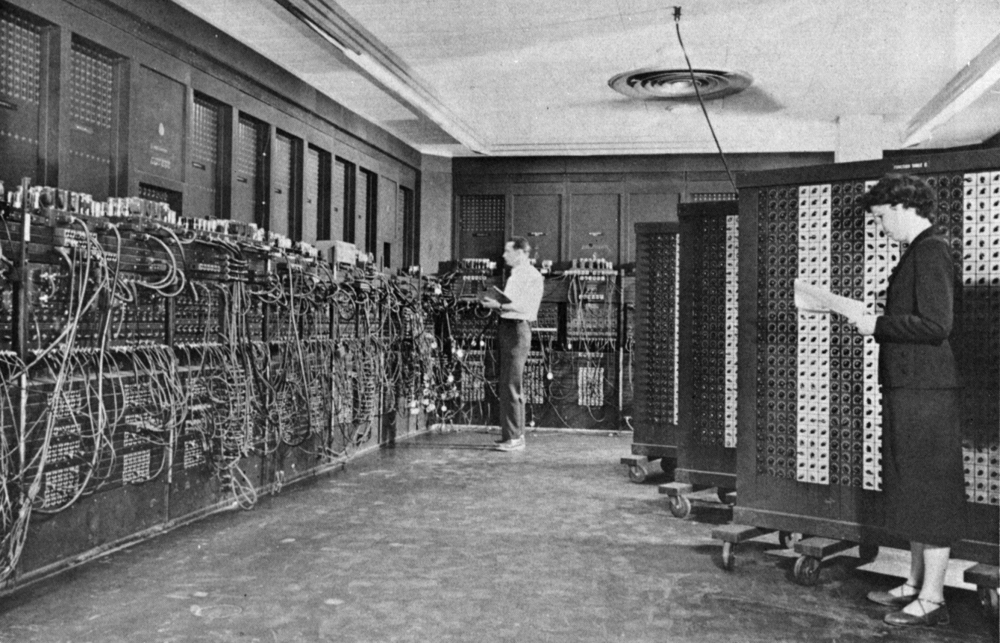
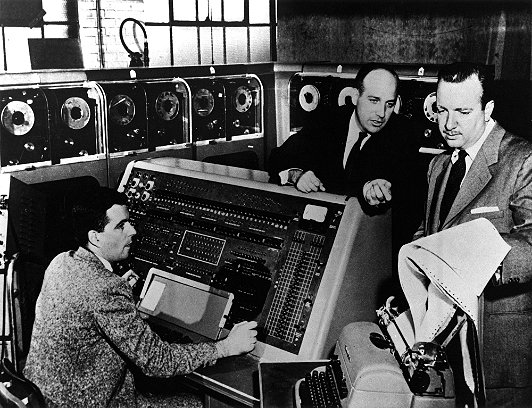

.. include:: ../global.rst

.. index:: vacuum tube, Colossus

The First Generation
=======================

.. sidebar:: Vacuum tube

    .. image:: Images/vacuum-tube.jpg
        :alt: Vacuum tube
        :width: 100

    The fundamental building block of most early computers.

Generations of computers are largely defined by the components used to build them. Although mechanical computers like Babbage's Engines and the Hollerith desk would continue to see use well into the 20th century, mathematicians and engineers in the 1930's realized that the logic of computation - Boolean logic - could be implemented with electronic relays and switches. **Vacuum tubes**, an electrical component that can be used as a switching device, became the core components of the first electrical computers.

World War II inspired a great deal of mathematical work. The British developed a series of computational devices designed to do calculations required to break German codes. These devices culminated in **Colossus**, the world's first electronic digital computer that was all programmable. Operators could reprogram the machine by changing switches and rewiring connections. Colossus could not compute any possible program, but it could be "reprogrammed" to solve different problems relating to the breaking of codes.

.. raw:: html

    
<a target="_blank" class="my-video-overlay" href="http://www.computerhistory.org/revolution/birth-of-the-computer/4/82/2218"></a>
Computer History Museum

Breaking The Code

.. index:: ENIAC

In 1946, the US finished work on **ENIAC**, designed to calculate artillery firing tables for the army. It is regarded as the first truly general purpose computer - it could run an arbitrary series of mathematical operations. But, like the Colossus, its program was represented through the physical wiring of the machine. Unlike Colossus, which was part of an ultra-secret British program, the ENIAC was widely known of.

   ..

   The ENIAC computer took up 1800 sq. feet and consumed 150kW of power.

.. pseudo_h3:: The Stored Program Computer
    :class: underlined

Early computing machines had fixed programs. For example, a desk calculator is a fixed program computer. It can do basic mathematics, but it cannot be used as a word processor or a gaming console. Changing the program of a fixed-program machine requires re-wiring, re-structuring, or re-designing the machine. The earliest computers were not so much "programmed" as they were "designed". "Reprogramming", when it was possible at all, was a laborious process, starting with flowcharts and paper notes, followed by detailed engineering designs, and then the often-arduous process of physically re-wiring and re-building the machine. With the proposal of the stored-program computer, this changed. A stored-program computer includes by design an instruction set and can store in memory a set of instructions (a program) that details the computation.

.. _vonNeumann:

.. sidebar::  \

    .. image:: Images/420px-Von_Neumann_architecture.png
        :alt: von Neumann Architecture

    The basic architecture of most modern computers.

.. index:: EDVAC, Manchester Baby, UNIVAC, von Neumann architecture

.. index::
    single: von Neumann, John

Even before the ENIAC was finished, its designers, John Mauchly and J. Presper Eckert, recognized its limitations and started the design of a stored-program computer, the EDVAC. It was the first general-purpose computer designed to store its instructions electronically, allowing new programs to be run without physical modification to them machine. The basic architecture of this machine is known as the "\ **von Neumann architecture**" after researcher, John von Neumann, who described it. The von Neumann architecture serves as the basic blueprint for almost every modern computer.

Although EDVAC was the first general-purpose stored program computer designed, it was not the first to run a program. That honor goes to the **Manchester "baby"**, a machine built at the University of Manchester in England. It ran its first program in June of 1948. What actually represents the first computer depends on how you define "computer", but generally these two machines are considered to represent the first modern computers - electrical devices capable of storing in memory a program to do any arbitrary calculation.

By 1950s, computers had left the labs and gone mainstream - machines like the UNIVAC and the IBM 650 were sold commercially to government and businesses. The UNIVAC became publicly well known when CBS news used it to run a prediction of the 1952 Presidential election. The polls were predicting a win for Adlai Stevenson, but a UNIVAC program run for CBS predicted correctly that Eisenhower would win the race.

   Image courtesy of Computer History Museum.

   UNIVAC designer J. Presper Eckert and operator Harold Sweeney demonstrate the UNIVAC to CBS newsman Walter Cronkite.

.. quick_attribution:: Wikipedia
