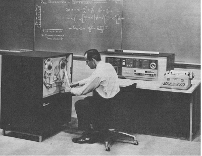

.. include:: ../global.rst

.. index:: Second Generation, transistor

The Second Generation
=====================================

.. sidebar:: Transistor

    .. image:: Images/transistor.jpg
        :alt: Transistor
        :width: 125
        
    Transistors: the defining component of Second Generation computers.
    
Vacuum tubes had numerous disadvantages as a building block for computers; not only were they quite large, they consumed large amounts of electrical current and produced large amounts of waste heat. First-generation computers were room-sized and required gigantic air conditioning systems. Even when properly cooled, the vacuum tubes still were prone to burning out and needing to be replaced.

The **transistor** was invented in 1947. The transistor did the same basic job as a vacuum tube - function as an electronic switch that could either be on or off - but was faster, more reliable, smaller, and much cheaper to build.

.. raw:: html

    

    <a target="_blank" class="my-video-overlay" href="http://www.computerhistory.org/revolution/digital-logic/12/272/2217"></a>
    
Computer History Museum

The Silicon Engine (Stop watching at 6:00 mark)

    
By the end of the 1950s, they had replaced vacuum tubes in computers. The ability to pack more components into less space and have them operate reliably resulted in a new **Second Generation** of computers. These machines were smaller, more reliable and faster than the machines of the 1940s and early 1950s. However, they still generally took up multiple cabinets and were so expensive that only large corporations could afford them.

   
   ..
   
   The IBM 1620 - a Second Generation computer

   